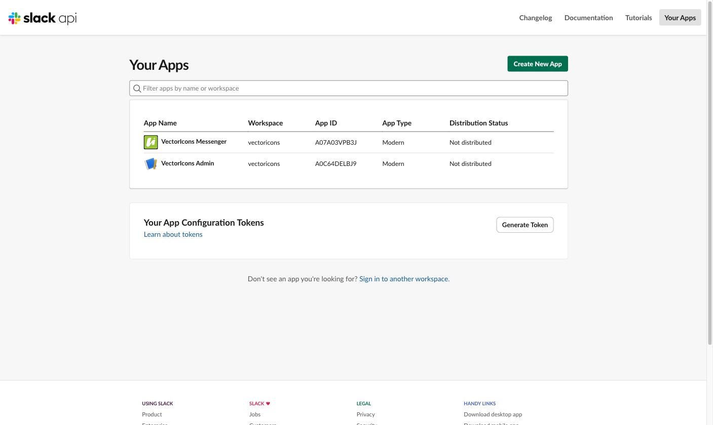
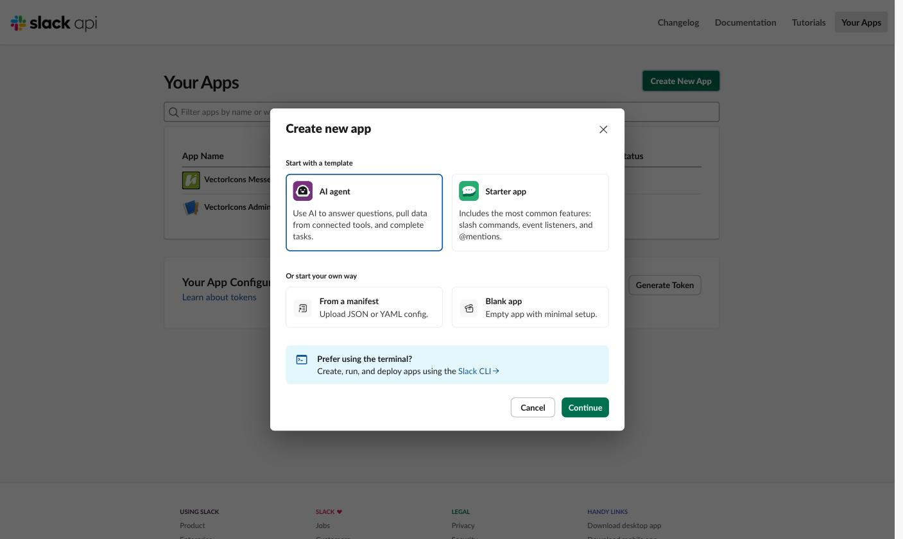
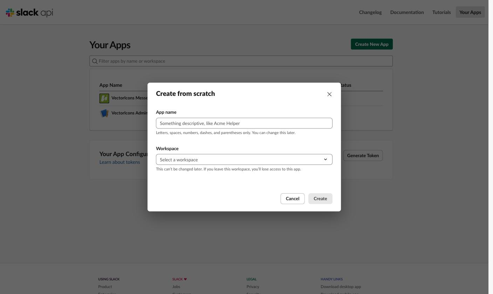
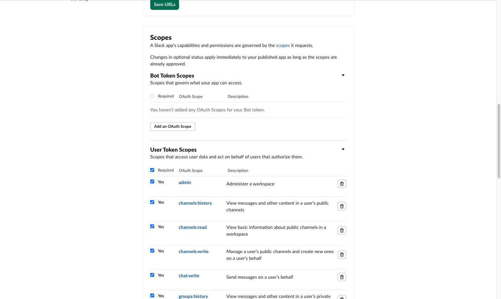

# slackctl

A command-line admin tool for Slack: inspect channels, list messages, delete messages with a preview and a typed confirmation, and send messages. Built for cleaning up automated posts (signup notices, transaction alerts, smoke-test chatter) without clicking through the Slack client.

```text
$ slackctl delete signups --date 2026-10-02 --pattern '/testmember[0-9]+/'

The following messages will be deleted:

DATE              TS                 USER                   MESSAGE
2026-10-02 04:36  1790930173.759609  VectorIcons Messenger  New signup: testmemberfe63ad7a (<mailto:…
2026-10-02 04:32  1790929966.208469  VectorIcons Messenger  New signup: testmember6871f161 (<mailto:…

Type 'delete' to confirm: delete
Deleted 1/2: 1790930173.759609
Deleted 2/2: 1790929966.208469
Deletion successful. 2 messages deleted.
```

## Requirements

- Node.js 20 or newer (the repository pins 20.11.0 in `.node-version`).
- A Slack **user token** for the workspace, with the scopes listed below, in the `SLACK_ADMIN_TOKEN` environment variable.

## Install

```bash
git clone git@github.com:iconifyit/slackctl.git
cd slackctl
npm install
```

Three ways to run it:

```bash
node bin/slackctl.js --help          # directly from the checkout
npm run -s slackctl -- --help        # through npm; -s keeps npm's banner off stdout, -- is required
npm link && slackctl --help          # as a global command (npm unlink -g slackctl to remove)
```

## Slack app and token setup

slackctl authenticates with a Slack **user token** (`xoxp-...`) issued to a Slack app you create in your own workspace. The token acts as *you*: it can read what you can read and delete what you can delete. Nothing is sent anywhere but Slack's API.

Official references: [Quickstart](https://docs.slack.dev/quickstart/) · [Token types](https://docs.slack.dev/authentication/tokens/) · [Installing with OAuth](https://docs.slack.dev/authentication/installing-with-oauth/) · [Scopes reference](https://docs.slack.dev/reference/scopes/) · [`chat.delete`](https://docs.slack.dev/reference/methods/chat.delete/) · [`conversations.list`](https://docs.slack.dev/reference/methods/conversations.list/)

### 1. Open your apps and create a new one

Go to [https://api.slack.com/apps](https://api.slack.com/apps) (sign in to the workspace if asked) and click **Create New App**.



### 2. Choose a blank app

Pick **Blank app** (no template is needed) and click **Continue**.



### 3. Name it and pick the workspace

Give it a descriptive name (for example "Workspace Admin CLI") and select the workspace it will run in, then click **Create**. The workspace cannot be changed later.



### 4. Add the user token scopes

In the app's sidebar open **OAuth & Permissions**, scroll to **Scopes**, and under **User Token Scopes** add:

| Scope | Why slackctl needs it |
| --- | --- |
| `channels:read` | list public channels (`channels`, name resolution) |
| `groups:read` | list private channels you belong to |
| `channels:history` | read messages in public channels |
| `groups:history` | read messages in private channels |
| `chat:write` | delete messages and send messages as you |

Click **Add an OAuth Scope** under **User Token Scopes** once per scope. Leave **Bot Token Scopes** empty; slackctl does not use a bot token. Do not add `admin` or any write scope beyond `chat:write`: the tool never calls those methods, and the ability to delete other people's messages comes from your workspace role, not from a scope (see below).



The **Add an OAuth Scope** button visible in the capture belongs to the Bot Token Scopes block; the User Token Scopes block below it has its own, just under the column header.

### 5. Install the app and copy the user token

At the top of the same **OAuth & Permissions** page click **Install to Workspace** and allow the requested permissions. Slack then shows a **User OAuth Token** beginning with `xoxp-`. Copy it. (This step is not pictured because the page displays the token itself.)

Treat the token like a password: it can delete messages in your name. Never commit it, paste it into chat, or put it in a URL.

### 6. Make the token available to slackctl

slackctl reads only the `SLACK_ADMIN_TOKEN` environment variable; it never opens a file on its own. Use a text editor for whichever you choose, so the token never appears in a typed command. Most shells record every command in a history file, which is why none of the forms below has you type the token at a prompt.

- **A file Node loads.** With your editor, create `.env` in the checkout (it is gitignored) containing one line, `SLACK_ADMIN_TOKEN=xoxp-...`, then run:

  ```bash
  node --env-file=.env bin/slackctl.js auth
  ```

- **Your shell profile.** With your editor, add `export SLACK_ADMIN_TOKEN=xoxp-...` to `~/.zshrc` (or `~/.bashrc`), open a new terminal, and run `slackctl auth`.

Do not type the token inline (`SLACK_ADMIN_TOKEN=xoxp-... slackctl ...`) or pipe it through `echo`; both land in shell history.

Then confirm:

```text
$ slackctl auth

Workspace:  vectoricons
User:       scott
User ID:    U04549YCJN7
Token:      user
Status:     authenticated
```

### Deleting other people's messages

With a user token, `chat.delete` can remove any message *you* could delete in the Slack client. Deleting someone else's message therefore requires that you are a Workspace Owner or Admin **and** that the workspace permits it (Settings & administration → Workspace settings → Permissions → Messaging, "who can delete messages"). If Slack refuses, slackctl reports `cant_delete_message` and stops at that message.

## Commands

```text
Usage: slackctl [options] [command]

Slack admin CLI: inspect channels, list and delete messages, send messages

Options:
  -V, --version                    output the version number
  -h, --help                       display help for command

Commands:
  auth                             show the workspace and user the token belongs
                                   to
  channels                         list channels with their IDs
  messages [options] <channel>     list messages in a channel, newest first
  delete [options] <channel>       delete messages after a preview and a typed
                                   confirmation
  send [options] <channel> <text>  send a message to a channel
  help [command]                   display help for command
```

Every command that takes a `<channel>` accepts a channel **name** (`signups`, `#signups`) or **ID** (`C0798E0AL0M`). Names are resolved through the channel list; IDs skip the lookup.

### `auth`

```text
Usage: slackctl auth [options]

show the workspace and user the token belongs to

Options:
  -h, --help  display help for command
```

### `channels`

```text
Usage: slackctl channels [options]

list channels with their IDs

Options:
  -h, --help  display help for command
```

```text
$ slackctl channels

NAME                  ID           TYPE     MEMBER
ai-collaborate        C0BT1LUQD51  public   yes
general               C0454CM1VA6  public   yes
signups               C0798E0AL0M  private  yes
transactions          C079BB7AZAN  private  yes
```

Archived channels are not listed. Private channels appear only if you are a member.

### `messages`

```text
Usage: slackctl messages [options] <channel>

list messages in a channel, newest first

Arguments:
  channel              channel name or ID (see `slackctl channels`)

Options:
  --mine               only messages posted by the authenticated user
  --pattern <regex>    only messages whose text matches, e.g.
                       '/testmember[0-9]+/i'
  --limit <n>          maximum messages (default 20; no default inside a range
                       or date)
  --date <YYYY-MM-DD>  only messages posted on that local calendar day
  --ts-from <ts>       inclusive lower bound (ts from the TS column)
  --ts-to <ts>         inclusive upper bound (ts from the TS column)
  -h, --help           display help for command
```

`messages` takes the same filters and bounds as `delete` (`--mine`, `--pattern`, `--limit`, `--date`, `--ts-from`, `--ts-to`), so it previews exactly what `delete` with the same options would remove. The two `delete`-only options, `--ts` and `--select`, have no listing counterpart: `--ts` names messages you already have from the `TS` column, and `--select` is a pick made at deletion time.

```bash
slackctl messages general --limit 5
slackctl messages development --mine --limit 3
slackctl messages signups --date 2026-10-02 --pattern '/testmember[0-9]+/'
```

The `TS` column is the message's Slack timestamp, which `delete --ts`, `--ts-from`, and `--ts-to` use.

### `delete`

```text
Usage: slackctl delete [options] <channel>

delete messages after a preview and a typed confirmation

Arguments:
  channel              channel name or ID (see `slackctl channels`)

Options:
  --mine               only messages posted by the authenticated user
  --pattern <regex>    only messages whose text matches, e.g.
                       '/testmember[0-9]+/i'
  --limit <n>          maximum messages (default 20; no default inside a range
                       or date)
  --date <YYYY-MM-DD>  only messages posted on that local calendar day
  --ts <ts...>         exact messages by ts; cannot be combined with other
                       selectors
  --ts-from <ts>       inclusive lower bound (ts from the TS column)
  --ts-to <ts>         inclusive upper bound (ts from the TS column)
  --select             pick messages from a numbered list before confirming
  --dry-run            preview only; perform no changes
  -h, --help           display help for command
```

Every `delete` run prints the candidates first, then requires you to type `delete` at an interactive terminal. There is no flag that skips the confirmation. Messages are deleted one at a time in the order shown in the preview (newest first, or the order you gave with `--ts`); on the first refusal from Slack the run stops and reports how far it got. Slack has no undo.

#### Newest N messages

The default when no range or date is given. `--limit` defaults to 20.

```bash
slackctl delete general --limit 3
```

#### Only your own messages

`--mine` keeps only messages posted by the token's user. It combines with `--limit`, `--pattern`, `--date`, and the `--ts-from`/`--ts-to` range, but not with `--ts`, which already names its messages.

```bash
slackctl delete development --mine --limit 10
```

#### By exact timestamp

`--ts` takes one or more values from the `TS` column. Each is fetched and shown before anything is deleted; an unknown timestamp aborts the whole run. `--ts` cannot be combined with the other selectors.

```bash
slackctl delete general --ts 1790971046.377099
slackctl delete general --ts 1790971046.377099 1790971046.843499
```

#### By timestamp range

`--ts-from` and `--ts-to` are inclusive and either may be given alone. A range has **no default limit**: everything inside it is a candidate unless you add `--limit`.

```bash
slackctl delete general --ts-from 1790800920.000300 --ts-to 1790871420.000200
slackctl delete general --ts-from 1790800920.000300 --limit 50
```

#### By calendar day

`--date` selects one local day (midnight to midnight in your timezone). Like a range, it has no default limit.

```bash
slackctl delete signups --date 2026-10-02
```

#### By text pattern

`--pattern` is a JavaScript regular expression matched against each message's raw text (Slack markup included, so an email address appears as `<mailto:...|...>`). Write it as `/body/flags` or as a bare body. It combines with `--mine`, `--date`, ranges, and `--limit`; with `--limit`, the limit counts matches.

```bash
slackctl delete signups --date 2026-10-02 --pattern '/testmember[0-9]+/'
slackctl delete signups --pattern '/test(member|contributor)[a-z0-9]{8}/' --limit 50
slackctl delete alerts --pattern '/signup\+test-[a-z0-9]+@example\.com/i'
```

#### Interactive pick

`--select` numbers the candidates and asks which to delete (`1,3-5` or `all`) before the usual confirmation. It works with every mode except `--ts`.

```text
$ slackctl delete general --limit 4 --select

The following messages will be deleted:

#  DATE              TS                 USER         MESSAGE
1  2026-10-02 15:57  1790971047.509209  U04549YCJN7  slackctl smoke test control
2  2026-10-02 15:57  1790971047.163739  U04549YCJN7  slackctl smoke-3
3  2026-10-02 15:57  1790971046.843499  U04549YCJN7  slackctl smoke-2
4  2026-10-02 15:57  1790971046.377099  U04549YCJN7  slackctl smoke-1
Select messages to delete (e.g. 1,3-5 or all): 2,4

Selected:

DATE              TS                 USER         MESSAGE
2026-10-02 15:57  1790971047.163739  U04549YCJN7  slackctl smoke-3
2026-10-02 15:57  1790971046.377099  U04549YCJN7  slackctl smoke-1

Type 'delete' to confirm: delete
Deleted 1/2: 1790971047.163739
Deleted 2/2: 1790971046.377099
Deletion successful. 2 messages deleted.
```

#### Dry run

`--dry-run` prints the preview and exits without asking for confirmation or deleting anything. Without `--select` it is the one `delete` form that works without a terminal, so it is safe in scripts and cron jobs. With `--select` the pick still happens and still needs a terminal; a script that passes `--select --dry-run` exits 1 with `Interactive selection requires a terminal; drop --select for a non-interactive preview.`

```bash
slackctl delete signups --date 2026-10-02 --pattern '/testmember[0-9]+/' --dry-run
```

### `send`

```text
Usage: slackctl send [options] <channel> <text>

send a message to a channel

Arguments:
  channel     channel name or ID (see `slackctl channels`)
  text        message text

Options:
  --dry-run   preview only; perform no changes
  -h, --help  display help for command
```

```bash
slackctl send development "Deploy of 1.4.2 is complete." --dry-run
slackctl send development "Deploy of 1.4.2 is complete."
```

## Behavior worth knowing

- **stdout is data, stderr is everything else.** Tables and results go to stdout; prompts, progress (`Deleted 3/20: ...`), rate-limit waits, and errors go to stderr. `slackctl channels | grep private` works.
- **Rate limits are handled.** On HTTP 429 the tool waits exactly as long as Slack's `Retry-After` asks, says so on stderr, and retries, up to five attempts per request. There are no fixed sleeps.
- **Terminal safety.** Message text and author names come from other users and apps, so escape sequences and control characters are stripped before anything is printed; a message cannot rewrite the preview before you confirm.
- **Timestamps and dates** are shown in your local timezone; `--date` is interpreted the same way.

### Exit codes

| Code | Meaning |
| --- | --- |
| 0 | Success, or `--help` / `--version`, or an aborted confirmation (nothing deleted) |
| 1 | Runtime error: missing token, Slack refused the request, channel or message not found, confirmation needed but no terminal |
| 2 | Usage error: bad option value, conflicting options, missing argument |

## Development

```bash
npm test          # 97 tests under node:test, offline against a fake Slack
```

The architecture decision record and implementation plan live under `docs/adr/`. Source layout: `bin/slackctl.js` (entry and exit codes), `src/slack.js` (transport), `src/conversations.js` and `src/messages.js` (domain services), `src/output.js` (rendering and prompts), `src/commands/` (one file per command).
