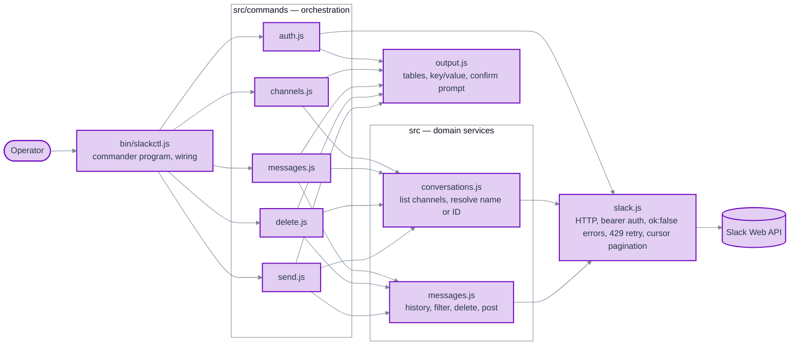

# [DEPRECATED]

Superseded by [0.0.2](./ADR-001-slackctl-cli-architecture-0.0.2.md).

# ADR-001: slackctl CLI Architecture

**Status**: Proposed
**Version**: 0.0.1
**Date**: 2026-10-02
**Deciders**: Scott Lewis (owner); Claude (author)
**Source task**: `automations/task.md`

## Context

`automations/slackctl/` currently holds a single-purpose script, `index.js`, that deletes the authenticated user's messages from one channel. It reads `SLACK_ADMIN_TOKEN`, takes a channel ID and a count as positional arguments, previews matching messages, and deletes only when `DELETE=YES` is set in the environment. All transport, pagination, filtering, output, and orchestration live in one file.

The task replaces this script with a multi-command admin CLI, `slackctl`, with the commands `auth`, `channels`, `messages`, `delete`, `send`, and `help`. The task prescribes a file layout, example output for each command, a typed confirmation (`delete`) before deletion, `--dry-run` on `delete` and `send`, cursor pagination, and clear error messages for authentication and deletion failures.

Facts about the current state that constrain the design (verified by reading the files named):

- `package.json` already declares `"type": "module"`, `"bin": { "slackctl": "./bin/slackctl.js" }`, and a single dependency, `commander ^14.0.0` (14.0.3 installed). Commander 14 requires Node 20 or newer (`node_modules/commander/package.json` engines field).
- `.node-version` pins `20.11.0`. `nodenv` is installed, so interactive shells in this directory select that version. A shell that ignores `.node-version` resolves Node 18, under which commander 14 is unsupported.
- The token is defined as `SLACK_ADMIN_TOKEN` in `automations/.env`. Sibling CLIs (`burn-rate`, `site-health`, `traffic-stats`) read `process.env` directly and do not depend on `dotenv`.
- The existing script sleeps 61 seconds between history pages and requests 15 messages per page, with a comment that `conversations.history` is heavily rate limited for newly created non-Marketplace apps. This matches Slack's 2025 rate-limit tier for such apps (one `conversations.history` request per minute, at most 15 messages per request).
- Sibling CLIs are CommonJS. `slackctl` is already declared ESM, and commander 14 supports ESM natively.
- Nothing outside `slackctl/` references `slackctl/index.js` (verified with `grep -rn slackctl` across `automations/`, excluding `node_modules`).

### Requirement conflicts resolved by this ADR

1. **Channel by name versus ID.** The requirements say the user specifies a channel ID. The examples pass a channel name (`development`). Both are accepted; see Decision 4.
2. **`--mine` on `delete`.** The requirements state the tool deletes only messages sent by the authenticated user. The example passes `--mine` to `delete`. The restriction is an unconditional invariant; see Decision 6.
3. **`send` missing from the layout.** The layout lists four command files; the requirements add a `send` command. The layout gains `src/commands/send.js`.

## Decision

Build `slackctl` as a small layered CLI with four responsibility boundaries: an entry point that wires commander, command handlers that orchestrate, domain services that know Slack's conversation and message semantics, and a transport that knows HTTP and the Slack Web API envelope. Output formatting is a shared presentation module.

### Component decomposition



| Component | Files | Owns | Public contract |
| --- | --- | --- | --- |
| Entry | `bin/slackctl.js` | Reading `SLACK_ADMIN_TOKEN`, constructing the Slack client, registering commands with commander, top-level error-to-exit-code mapping | The `slackctl` executable |
| Commands | `src/commands/{auth,channels,messages,delete,send}.js` | Option parsing per command, calling services, confirmation flow, choosing what to print | One `register(program, context)` export per file |
| Conversations service | `src/conversations.js` | Listing channels across pages; resolving a channel reference (name or ID) to a channel record | `listChannels(client)`, `resolveChannel(client, ref)` |
| Messages service | `src/messages.js` | Fetching history newest-first across pages until a limit of matching messages is reached; filtering by author; deleting one message; posting one message | `fetchMessages(client, {channel, limit, userId})`, `deleteMessage(client, {channel, ts})`, `postMessage(client, {channel, text})` |
| Transport | `src/slack.js` | `POST https://slack.com/api/<method>` with bearer auth; converting `ok:false` into `SlackApiError`; honoring HTTP 429 `Retry-After` with bounded retries; a cursor-pagination async generator | `createSlackClient({token, fetch})` returning `{ call(method, args), paginate(method, args, pluck) }`; `SlackApiError` |
| Output | `src/output.js` | Fixed-width tables with uppercase headers, key/value blocks, one-line message text, local-time date formatting, the typed confirmation prompt | `table(columns, rows)`, `keyValue(pairs)`, `formatDate(ts)`, `oneLine(text)`, `confirm(expectedWord)` |

The two `messages.js` files share a basename because the task layout requires it. They sit in different directories and are always imported by explicit relative path, so the ambiguity is confined to file listings.

### Numbered decisions

1. **Framework and module system.** Use commander 14 as already declared, as an ESM package. ESM departs from the CommonJS sibling CLIs, but the package manifest already made that choice and commander 14 supports it without shims. Reversing it would be a change for consistency alone.

2. **Configuration.** The token comes from `process.env.SLACK_ADMIN_TOKEN` only. A missing or empty token is fatal before any network call, with the message `SLACK_ADMIN_TOKEN is not set.` and exit code 1. No `dotenv` dependency: it matches the sibling tools, and Node 20 provides `node --env-file=../.env bin/slackctl.js` for the case where the operator wants the shared `.env` loaded.

3. **Runtime.** Node 20.11.0 as pinned by `.node-version`. `package.json` gains `"engines": { "node": ">=20" }` so the constraint commander already imposes is visible at the package boundary.

4. **Channel reference resolution.** Every command that takes a channel accepts a name or an ID. A reference matching `^[CDG][A-Z0-9]{8,}$` is treated as an ID and used as-is; anything else is a name and is resolved through `conversations.list`, with `#` stripped if present. A name that matches no channel is an error (`Channel not found: <name>`), as is a name that matches more than one channel (the user must pass the ID). The `channels` command exists to make IDs discoverable, so accepting both is the intent behind both the requirement and the example.

5. **Pagination and limits.** The transport exposes a cursor-pagination generator that follows `response_metadata.next_cursor` until it is empty. Services consume only as many pages as needed to satisfy the caller's limit and stop. `conversations.history` is requested with `limit: 15` per page because the token's app is subject to the 15-per-request tier observed by the existing script; `conversations.list` uses `limit: 200`.

6. **Delete selects only the authenticated user's messages, unconditionally.** `delete` resolves the caller's user ID via `auth.test` and filters history to `message.user === userId` before anything is shown or removed. The command accepts `--mine` for parity with `messages` and so the documented invocation works, but it is always in effect; help text says so. There is no flag that widens the selection. This is the safety invariant that makes the tool an admin convenience rather than a moderation weapon.

7. **Confirmation and dry run.** `delete` always prints the preview table first. With `--dry-run`, it then exits 0 without prompting. Without it, it prompts `Type 'delete' to confirm: ` on stderr via `node:readline` and proceeds only if the operator types exactly `delete`. Any other input aborts with `Aborted. Nothing deleted.` and exit 0. If stdin is not a TTY the command refuses to delete, prints `Confirmation requires an interactive terminal; use --dry-run to preview.`, and exits 1. There is no `--yes` bypass. `send --dry-run` prints the resolved channel and the message text and exits without calling `chat.postMessage`.

8. **Deletion failure policy.** Messages are deleted sequentially, newest first, each with its own `chat.delete` call. On the first failure the command stops, reports how many were deleted and which `ts` failed with Slack's error code, and exits 1. Re-running is safe because already-deleted messages no longer appear in history. Stopping rather than continuing is the conservative choice when the cause of the failure is unknown.

9. **Rate limiting.** The transport handles HTTP 429 reactively: read `Retry-After`, write `Rate limited by Slack; waiting <n>s...` to stderr, sleep, retry, up to five attempts per call, then fail with `SlackApiError('ratelimited')`. No fixed sleeps between calls. This replaces the script's unconditional 61-second sleep with a wait only when Slack asks for one, at the cost of a slower first wait when the app is on the one-per-minute tier.

10. **Error strategy.** The transport throws `SlackApiError` carrying `method` and Slack's `error` code. The entry point maps known codes to actionable messages (`invalid_auth`, `not_authed`, `token_revoked`, `account_inactive` for authentication; `channel_not_found`, `not_in_channel`, `cant_delete_message`, `message_not_found`, `ratelimited` for operations) and prints `slackctl: <method> failed: <code>` for anything else. Runtime errors exit 1; commander's usage errors exit 2 (its default). Errors and progress go to stderr; data goes to stdout so output can be piped.

11. **Output.** Tables are computed-width columns with uppercase headers and two-space gutters, matching the examples. `DATE` is the message `ts` rendered as `YYYY-MM-DD HH:mm` in the local timezone. `MESSAGE` is the text collapsed to one line (newlines become spaces) and truncated to the terminal width, or 100 characters when stdout is not a TTY. `TYPE` is `public` or `private` from `is_private`; `MEMBER` is `yes` or `no` from `is_member`. Archived channels are excluded by default via `exclude_archived: true`.

12. **`auth` output.** Call `auth.test` and print `Workspace` (`team`), `User` (`user`), `User ID` (`user_id`), `Token` (derived from the token prefix: `xoxp-` user, `xoxb-` bot, `xoxe-` or `xoxe.xoxp-` refreshable user, otherwise `unknown`), and `Status: authenticated`. On failure print `Status: failed (<code>)` and exit 1.

13. **`help`.** Provided by commander: `slackctl help`, `slackctl --help`, and `slackctl <command> --help`. No custom help module.

14. **Command surface.**

    | Command | Arguments and options |
    | --- | --- |
    | `auth` | none |
    | `channels` | none |
    | `messages <channel>` | `--mine`, `--limit <n>` (default 20) |
    | `delete <channel>` | `--mine` (always on), `--limit <n>` (default 20), `--dry-run` |
    | `send <channel> <text>` | `--dry-run` |
    | `help [command]` | commander built-in |

### Layout

```text
slackctl/
├── bin/
│   └── slackctl.js
├── src/
│   ├── slack.js
│   ├── conversations.js
│   ├── messages.js
│   ├── output.js
│   └── commands/
│       ├── auth.js
│       ├── channels.js
│       ├── messages.js
│       ├── delete.js
│       └── send.js
├── test/
│   ├── fixtures/            # realistic Slack API response bodies
│   ├── slack.test.js
│   ├── conversations.test.js
│   ├── messages.test.js
│   ├── output.test.js
│   └── commands.test.js     # end-to-end through the commander program with a fake fetch
├── docs/adrs/ADR-001-slackctl-cli-architecture/
├── .node-version
├── package.json
└── package-lock.json
```

The task layout is extended by `src/commands/send.js` (required by the `send` requirement) and by `test/`.

## Rationale

- **Four layers, not more.** Transport, services, commands, and output are the only boundaries with distinct reasons to change: Slack's HTTP envelope, Slack's domain semantics, the operator's workflow, and the terminal rendering. Splitting further (a pagination module, a confirmation module, a channel-resolver module) would create single-function files with no independent contract.
- **Injectable `fetch`.** `createSlackClient({ token, fetch })` defaults to `globalThis.fetch`. Tests pass a fake that serves recorded fixtures. This makes integration tests through the whole command stack possible without network access and without mocking modules.
- **Services stop at the limit.** Fetching exactly as many pages as needed matters on a one-request-per-minute tier; over-fetching is minutes of wall-clock time.
- **Reactive 429 handling.** Slack tells the client how long to wait; encoding a fixed wait duplicates that knowledge and is wrong whenever the app's tier changes.
- **Typed confirmation with no bypass.** The requirement names the mechanism. Adding `--yes` would re-create the `DELETE=YES` footgun the new design retires.

## Consequences

### Positive

- Each command is a short orchestration over two services and one output module, so adding a command (for example `replies`) is one file plus a `register` call.
- Destructive behavior is confined to one function in the messages service and one command, both gated by the same invariant and the same confirmation.
- The full command stack is testable offline with realistic fixtures.
- `stdout` carries only data, so `slackctl channels | grep` and similar compositions work.

### Negative

- Name resolution costs one or more `conversations.list` calls per command invocation on a name. Operators who care can pass the ID shown by `channels`.
- Fetching `--mine --limit 3` in a busy channel can take several minutes on the one-per-minute tier, because own messages may be sparse within 15-message pages. The progress line on stderr makes the wait visible but does not shorten it.
- ESM differs from the sibling CommonJS CLIs. Anyone copying patterns between tools has to translate import syntax.

### Neutral

- `--mine` on `delete` is accepted but cannot be turned off. The help text documents this so the flag does not read as a choice.
- Archived channels are not listed. A future flag could include them; none is added now.

## Alternatives Considered

### Keep the single-file script and add subcommands to it

Rejected. A single file holding transport, pagination, filtering, confirmation, and six commands fails the single-responsibility test at every level and cannot be tested without network access. The task's layout already rejects this.

### Use `@slack/web-api` instead of a hand-written transport

Rejected for now. The SDK brings automatic retry, pagination helpers, and typed methods, but it adds a substantial dependency tree for five API methods, and its retry defaults would need tuning for the one-per-minute tier anyway. The transport here is under a hundred lines and fully under test. Revisit if the command surface grows to need many more methods.

### Load `.env` with `dotenv` inside the tool

Rejected. Sibling CLIs do not, Node 20 provides `--env-file`, and reading `process.env` keeps the tool's configuration surface to one documented variable.

### Delete concurrently, or continue past failures

Rejected. Concurrent deletes hit Slack's per-method limit faster and make the failure report harder to read. Continuing past a failure risks repeating a systemic error dozens of times; stopping and re-running is cheap because deletion is idempotent from the operator's point of view.

### Make `delete` require `--mine` explicitly or drop the flag entirely

Rejected. Requiring it adds ceremony with only one valid answer. Dropping it breaks the documented invocation in `task.md`. Accepting it as always-on satisfies both.

### Proactive fixed sleep between history pages (as the current script does)

Rejected in favor of reactive `Retry-After` handling; see Decision 9.

## Code being removed

- `slackctl/index.js`: the single-purpose delete script. Superseded in full by `bin/slackctl.js` and `src/`. Verified unreferenced: `package.json` has no `main`, `bin` points to `bin/slackctl.js`, and `grep -rn slackctl automations/ --exclude-dir=node_modules` finds no import or shell invocation of it. Deleted in the same change that lands the new entry point.

## Verification strategy

Tests use `node:test` and `node:assert` (no new dependencies) with recorded, realistic Slack response fixtures and a frozen clock where dates are rendered.

- **Transport (unit).** `ok:false` becomes `SlackApiError` with method and code; 429 with `Retry-After: 2` sleeps and retries, and a sixth 429 fails; pagination yields pages until `next_cursor` is empty and passes the cursor on each subsequent request.
- **Conversations service (unit).** An ID reference is returned without a list call; a name resolves across two pages; an unknown name and an ambiguous name each fail with the specified message; `#name` is accepted.
- **Messages service (unit).** `fetchMessages` with `userId` and `limit: 3` stops requesting pages once three own messages are found and never returns a fourth; without `userId` it returns the newest `limit` messages across pages; `deleteMessage` propagates `cant_delete_message`.
- **Output (unit).** Table widths follow the longest cell; multi-line text collapses to one line; `formatDate` renders a known `ts` to the expected local string under a fixed `TZ`.
- **Commands (integration).** Run the commander program in-process against a fake `fetch`: `auth` prints the five fields; `channels` prints the table from a two-page fixture; `messages development --mine --limit 3` resolves the name and prints three rows; `delete ... --dry-run` prints the preview, performs no `chat.delete`, and exits 0; `delete` with a scripted stdin of `delete` deletes in order and stops on an injected failure with the correct report and exit 1; `delete` with non-TTY stdin and no `--dry-run` refuses; `send --dry-run` performs no `chat.postMessage`; a missing token exits 1 before any request.
- **Manual (live).** Against the real workspace: `auth`, `channels`, `messages <scratch-channel> --mine --limit 3`, `delete <scratch-channel> --dry-run --limit 1`, `send <scratch-channel> "slackctl smoke test" --dry-run`, then one real `send` and one real `delete` of that message in a scratch channel. No live test touches a channel other than the scratch channel.

## Implementation plan

To be written in `imp/ADR-001-slackctl-cli-architecture-implementation-plan.md` after this ADR is approved.


