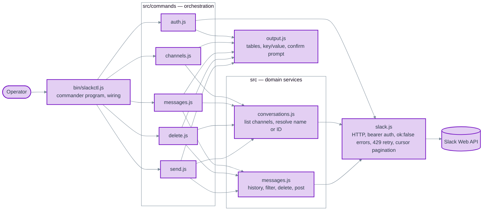

# ADR-001: slackctl CLI Architecture

**Status**: Accepted (2026-10-02)
**Version**: 0.0.5 (supersedes [0.0.4](./ADR-001-slackctl-cli-architecture-0.0.4.md))
**Date**: 2026-10-02
**Deciders**: Scott Lewis (owner); Claude (author)
**Source task**: `automations/task.md`

## Context

`automations/slackctl/` currently holds a single-purpose script, `index.js`, that deletes the authenticated user's messages from one channel. It reads `SLACK_ADMIN_TOKEN`, takes a channel ID and a count as positional arguments, previews matching messages, and deletes only when `DELETE=YES` is set in the environment. All transport, pagination, filtering, output, and orchestration live in one file.

The task replaces this script with a multi-command admin CLI, `slackctl`, with the commands `auth`, `channels`, `messages`, `delete`, `send`, and `help`. The task prescribes a file layout, example output for each command, a typed confirmation (`delete`) before deletion, `--dry-run` on `delete` and `send`, cursor pagination, and clear error messages for authentication and deletion failures.

Facts about the current state that constrain the design (verified by reading the files named):

- `package.json` declares `"type": "module"`, `"bin": { "slackctl": "./bin/slackctl.js" }`, and a single dependency, `commander ^14.0.0` (14.0.3 installed). Commander 14 requires Node 20 or newer (`node_modules/commander/package.json` engines field) and supports both CommonJS and ESM consumers.
- `.node-version` pins `20.11.0`. `nodenv` is installed, so interactive shells in this directory select that version. A shell that ignores `.node-version` resolves Node 18, under which commander 14 is unsupported.
- The token is defined as `SLACK_ADMIN_TOKEN` in `automations/.env`. Sibling CLIs (`burn-rate`, `site-health`, `traffic-stats`) are CommonJS, read `process.env` directly, and do not depend on `dotenv`.
- The existing script sleeps 61 seconds between history pages and requests 15 messages per page, with a comment that `conversations.history` is heavily rate limited for newly created non-Marketplace apps. Whether this token's app is actually on that tier has not been measured; the sleep was a guess encoded as a constant.
- Nothing outside `slackctl/` references `slackctl/index.js` (verified with `grep -rn slackctl` across `automations/`, excluding `node_modules`).

### Requirement conflicts resolved by this ADR

1. **Channel by name versus ID.** The requirements say the user specifies a channel ID. The examples pass a channel name (`development`). Both are accepted; see Decision 4.
2. **Whose messages `delete` may remove.** The task text says the tool deletes only messages sent by the authenticated user, and the example passes `--mine`. The owner's decision during review is that an admin may delete any message. `--mine` is therefore an optional filter on `delete`, exactly as on `messages`; see Decision 6.
3. **`send` missing from the layout.** The layout lists four command files; the requirements add a `send` command. The layout gains `src/commands/send.js`.
4. **Module system.** The package manifest declares ESM; the sibling CLIs are CommonJS. The owner prefers consistency with the sibling tools; see Decision 1.
5. **Selecting messages by identity.** The task selects messages only by count (`--limit`) and author (`--mine`). The owner asked during review of 0.0.2 for deletion by explicit `ts`, by `ts` range, and by interactive pick from a list; see Decision 15.
6. **Selecting messages by content and day.** The owner asked during review of 0.0.3 for deletion by text pattern on a given calendar day, motivated by app-posted notifications such as `New signup: testmember1ed43567 (...)` that need periodic cleanup; see Decision 16.

## Decision

Build `slackctl` as a small layered CLI with four responsibility boundaries: an entry point that wires commander, command handlers that orchestrate, domain services that know Slack's conversation and message semantics, and a transport that knows HTTP and the Slack Web API envelope. Output formatting is a shared presentation module.

### Component decomposition



| Component | Files | Owns | Public contract |
| --- | --- | --- | --- |
| Entry | `bin/slackctl.js` | Reading `SLACK_ADMIN_TOKEN`, constructing the Slack client, registering commands with commander, top-level error-to-exit-code mapping | The `slackctl` executable |
| Commands | `src/commands/{auth,channels,messages,delete,send}.js` | Option parsing per command, calling services, confirmation flow, choosing what to print | One `register(program, context)` export per file |
| Conversations service | `src/conversations.js` | Listing channels across pages; resolving a channel reference (name or ID) to a channel record | `listChannels(client)`, `resolveChannel(client, ref)` |
| Messages service | `src/messages.js` | Fetching history newest-first across pages until a limit of matching messages is reached, optionally bounded by a `ts` range and filtered by author and by a text pattern; parsing a pattern expression into a `RegExp`; fetching single messages by `ts`; deleting one message; posting one message | `fetchMessages(client, {channel, limit, userId, pattern, oldest, latest})`, `fetchMessagesByTs(client, {channel, tsList})`, `parsePattern(expression)`, `deleteMessage(client, {channel, ts})`, `postMessage(client, {channel, text})` |
| Transport | `src/slack.js` | `POST https://slack.com/api/<method>` with bearer auth; converting `ok:false` into `SlackApiError`; honoring HTTP 429 `Retry-After` with bounded retries; a cursor-pagination async generator | `createSlackClient({token, fetch})` returning `{ call(method, args), paginate(method, args, pluck) }`; `SlackApiError` |
| Output | `src/output.js` | Fixed-width tables with uppercase headers, key/value blocks, one-line message text, local-time date formatting and the local-day-to-`ts`-range conversion, the typed confirmation prompt, the interactive pick prompt and its selection grammar | `table(columns, rows)`, `keyValue(pairs)`, `formatDate(ts)`, `dayRange(date)`, `oneLine(text)`, `confirm(expectedWord)`, `pick(count)`, `parseSelection(expression, count)` |

The two `messages.js` files share a basename because the task layout requires it. They sit in different directories and are always imported by explicit relative path, so the ambiguity is confined to file listings.

### Numbered decisions

1. **Framework and module system.** Use commander 14 as already declared, as a **CommonJS** package, consistent with the sibling CLIs in `automations/`. The `"type": "module"` entry is removed from `package.json`. Commander 14 is consumed with `require('commander')`.

2. **Configuration.** The token comes from `process.env.SLACK_ADMIN_TOKEN` only. A missing or empty token is fatal before any network call, with the message `SLACK_ADMIN_TOKEN is not set.` and exit code 1. No `dotenv` dependency: it matches the sibling tools, and Node 20 provides `node --env-file=../.env bin/slackctl.js` for the case where the operator wants the shared `.env` loaded.

3. **Runtime.** Node 20.11.0 as pinned by `.node-version`. `package.json` gains `"engines": { "node": ">=20" }` so the constraint commander already imposes is visible at the package boundary.

4. **Channel reference resolution.** Every command that takes a channel accepts a name or an ID. A reference matching `^[CDG][A-Z0-9]{8,}$` is treated as an ID and used as-is; anything else is a name and is resolved through `conversations.list`, with `#` stripped if present. A name that matches no channel is an error (`Channel not found: <name>`), as is a name that matches more than one channel (the user must pass the ID). The `channels` command exists to make IDs discoverable, so accepting both is the intent behind both the requirement and the example.

5. **Pagination and limits.** The transport exposes a cursor-pagination generator that follows `response_metadata.next_cursor` until it is empty. Services consume only as many pages as needed to satisfy the caller's limit and stop. Page sizes are single constants: `conversations.history` requests 100 per page (Slack's default) and `conversations.list` requests 200. If Slack caps a response below the requested size, cursor-following absorbs it with no code change. If Slack instead rejects the size for this app's tier, the constant is lowered; that is verified during the live smoke test, not guessed in advance.

6. **Delete selects the newest N messages in the channel from any author; `--mine` narrows it to the caller.** `delete` resolves the caller's user ID via `auth.test` only when `--mine` is given, and passes it to `fetchMessages` as the author filter, exactly as `messages` does. Without `--mine`, the preview and the deletions cover other people's messages. Slack enforces its own permission check on `chat.delete`: deleting another user's message requires the token's user to be a workspace admin or owner with that permission enabled, and otherwise fails with `cant_delete_message`, which stops the run per Decision 8. Because the tool can remove other people's messages, every preview row carries the author (Decision 11).

7. **Confirmation and dry run.** `delete` always prints the preview table first. With `--dry-run`, it then exits 0 without prompting. Without it, it prompts `Type 'delete' to confirm: ` on stderr via `node:readline` and proceeds only if the operator types exactly `delete`. Any other input aborts with `Aborted. Nothing deleted.` and exit 0. If stdin is not a TTY the command refuses to delete, prints `Confirmation requires an interactive terminal; use --dry-run to preview.`, and exits 1. There is no `--yes` bypass. `send --dry-run` prints the resolved channel and the message text and exits without calling `chat.postMessage`.

8. **Deletion failure policy.** Messages are deleted sequentially, newest first, each with its own `chat.delete` call. On the first failure the command stops, reports how many were deleted and which `ts` failed with Slack's error code, and exits 1. Re-running is safe because already-deleted messages no longer appear in history. Stopping rather than continuing is the conservative choice when the cause of the failure is unknown.

9. **Rate limiting.** There is no fixed sleep anywhere in the tool. The transport handles HTTP 429 reactively: read `Retry-After`, write `Rate limited by Slack; waiting <n>s...` to stderr, sleep exactly that long, retry, up to five attempts per call, then fail with `SlackApiError('ratelimited')`. Every call runs at full speed until Slack says otherwise, and waits only as long as Slack asks. This retires the script's unconditional 61-second sleep, which made the script slower than deleting by hand whenever the app was not actually on the restricted tier.

10. **Error strategy.** The transport throws `SlackApiError` carrying `method` and Slack's `error` code. The entry point maps known codes to actionable messages (`invalid_auth`, `not_authed`, `token_revoked`, `account_inactive` for authentication; `channel_not_found`, `not_in_channel`, `cant_delete_message`, `message_not_found`, `ratelimited` for operations) and prints `slackctl: <method> failed: <code>` for anything else. Runtime errors exit 1; usage errors exit 2, installed explicitly at the entry point rather than taken from commander's default. Errors and progress go to stderr; data goes to stdout so output can be piped.

11. **Output.** Tables are computed-width columns with uppercase headers and two-space gutters, matching the examples. The `messages` and `delete` tables have the columns `DATE`, `TS`, `USER`, `MESSAGE`. `USER` is the author's user ID, which the task prose lists as a displayed field and which the preview needs once deletion can cover other authors; it costs no extra API calls. Messages posted by apps carry no `user`; for those the column shows `username` when present, otherwise `bot_id`, so an app-posted notification is never shown with a blank author. `DATE` is the message `ts` rendered as `YYYY-MM-DD HH:mm` in the local timezone. `MESSAGE` is the text collapsed to one line (newlines become spaces) and truncated to the terminal width, or 100 characters when stdout is not a TTY. In the `channels` table, `TYPE` is `public` or `private` from `is_private` and `MEMBER` is `yes` or `no` from `is_member`. Archived channels are excluded by default via `exclude_archived: true`.

12. **`auth` output.** Call `auth.test` and print `Workspace` (`team`), `User` (`user`), `User ID` (`user_id`), `Token` (derived from the token prefix: `xoxp-` user, `xoxb-` bot, `xoxe-` or `xoxe.xoxp-` refreshable user, otherwise `unknown`), and `Status: authenticated`. On failure print `Status: failed (<code>)` and exit 1.

13. **`help`.** Provided by commander: `slackctl help`, `slackctl --help`, and `slackctl <command> --help`. No custom help module.

14. **Command surface.**

    | Command | Arguments and options |
    | --- | --- |
    | `auth` | none |
    | `channels` | none |
    | `messages <channel>` | `--mine`, `--pattern <regex>`, `--limit <n>` (default 20), `--date <YYYY-MM-DD>`, `--ts-from <ts>`, `--ts-to <ts>` |
    | `delete <channel>` | `--mine`, `--pattern <regex>`, `--limit <n>` (default 20), `--date <YYYY-MM-DD>`, `--ts <ts...>`, `--ts-from <ts>`, `--ts-to <ts>`, `--select`, `--dry-run` |
    | `send <channel> <text>` | `--dry-run` |
    | `help [command]` | commander built-in |

15. **Selecting messages by identity: explicit `ts`, `ts` range, and interactive pick.** `delete` builds its candidate set in one of three mutually exclusive modes, then applies the same preview, `--dry-run`, typed confirmation, and stop-on-first-failure flow to whatever that set contains.

    - **Newest-N mode (default).** `--limit` and `--mine` as before.
    - **Explicit `ts` mode: `--ts <ts...>`.** One or more timestamps as printed in the `TS` column. Each is fetched individually with `conversations.history` using `oldest` and `latest` set to that `ts` and `inclusive: true`, so the preview still shows date, author, and text. Resolution is all-or-nothing: if any `ts` is not found in the channel, the command reports `Message not found: <ts>` and exits 1 before anything is deleted. `--ts` cannot be combined with `--limit`, `--mine`, `--ts-from`, `--ts-to`, or `--select`; commander rejects the combination as a usage error.
    - **Range mode: `--ts-from <ts>` and/or `--ts-to <ts>`.** Inclusive bounds passed to `conversations.history` as `oldest` and `latest` with `inclusive: true`. Either bound may be given alone: `--ts-from` alone means from that message to the newest; `--ts-to` alone means from the oldest to that message. `--mine` filters within the range. `--limit` caps the range at the newest N matches; without `--limit`, range mode has no cap, because a range is itself the operator's statement of scope, and the preview plus confirmation remain the guard. `--ts-from` greater than `--ts-to` is a usage error.
    - **Interactive pick: `--select`.** A modifier for newest-N and range modes. The candidate table is printed with a leading `#` column, then the operator is prompted on stderr with `Select messages to delete (e.g. 1,3-5 or all): `. The grammar is a comma-separated list of 1-based indices and inclusive index ranges, or the word `all`; anything else, an out-of-range index, or an empty answer re-prompts up to three times and then aborts with `Aborted. Nothing deleted.` The picked subset becomes the candidate set and the normal preview and typed `delete` confirmation follow, so the operator sees exactly the final set once more before confirming. `--select` requires a TTY like the confirmation does, and `--select --dry-run` performs the pick and then exits without prompting for confirmation.

    `messages` gains `--ts-from` and `--ts-to` with the same semantics so that `messages` with a given set of options always lists exactly what `delete` with the same options would preview. `messages` does not gain `--ts` or `--select`; listing by explicit `ts` is the `TS` column itself, and picking is only meaningful before a deletion.

    `conversations.history` returns top-level channel messages, including thread parents and broadcast replies. Replies that live only inside a thread are not reachable by any selector in this ADR; `--ts` on such a reply reports `Message not found`. Thread support is out of scope.

16. **Selecting messages by text pattern and by calendar day: `--pattern` and `--date`.** These extend the newest-N and range modes rather than adding a fourth mode.

    - **`--pattern <regex>`** is a filter, composed with `--mine` by logical AND, applied client-side to each message's `text` as the pages are fetched. The value is a JavaScript regular expression. The form `/body/flags` is accepted so that `--pattern '/testmember[0-9]+/i'` reads as it would in code; a value without surrounding slashes is the regular expression body with no flags. An expression that does not compile is a usage error naming the problem. The flag is a filter, so `--limit` counts matches, exactly as it does with `--mine`. `--pattern` cannot be combined with `--ts`, which already names its messages.
    - **`--date <YYYY-MM-DD>`** is range mode with the bounds computed for the operator: `oldest` is local midnight at the start of that day and `latest` is local midnight at the start of the next day, exclusive on the upper bound, so that a message at exactly `00:00:00` belongs to one day only. Local time is used because the `DATE` column is rendered in local time; the day the operator reads in the table is the day `--date` selects. `--date` is mutually exclusive with `--ts`, `--ts-from`, and `--ts-to`; like range mode, it has no default `--limit`. A value that is not a real calendar date is a usage error.
    - The motivating invocation is therefore `slackctl delete signups --date 2026-09-30 --pattern '/testmember[0-9]+/'`: fetch every message posted on that local day, keep the ones whose text matches, preview them with their author, and delete on a typed `delete`. `--select` composes with this as with any other candidate set.

    `messages` gains both options with the same semantics, keeping the rule that `messages` with a given set of options lists exactly what `delete` with the same options would preview.

    Pattern matching is client-side rather than via Slack's `search.messages` API. Search requires an additional scope, indexes with a delay, tokenizes rather than matching regular expressions, and returns a different message shape; a regular expression over the history pages the tool already fetches is exact, immediate, and needs nothing new from Slack.

### Layout

```text
slackctl/
├── bin/
│   └── slackctl.js
├── src/
│   ├── slack.js
│   ├── conversations.js
│   ├── messages.js
│   ├── output.js
│   └── commands/
│       ├── auth.js
│       ├── channels.js
│       ├── messages.js
│       ├── delete.js
│       └── send.js
├── test/
│   ├── fixtures/            # realistic Slack API response bodies
│   ├── slack.test.js
│   ├── conversations.test.js
│   ├── messages.test.js
│   ├── output.test.js
│   └── commands.test.js     # end-to-end through the commander program with a fake fetch
├── docs/adr/ADR-001-slackctl-cli-architecture/
├── .node-version
├── package.json
└── package-lock.json
```

The task layout is extended by `src/commands/send.js` (required by the `send` requirement) and by `test/`.

## Rationale

- **Four layers, not more.** Transport, services, commands, and output are the only boundaries with distinct reasons to change: Slack's HTTP envelope, Slack's domain semantics, the operator's workflow, and the terminal rendering. Splitting further (a pagination module, a confirmation module, a channel-resolver module) would create single-function files with no independent contract.
- **CommonJS.** Every other CLI in `automations/` is CommonJS. Matching them keeps patterns copyable between tools; the manifest's ESM declaration had no code behind it yet, so changing it costs nothing.
- **Injectable `fetch`.** `createSlackClient({ token, fetch })` defaults to `globalThis.fetch`. Tests pass a fake that serves recorded fixtures. This makes integration tests through the whole command stack possible without network access and without mocking modules.
- **Services stop at the limit.** Fetching exactly as many pages as needed keeps the tool fast and keeps the request count, and therefore the chance of a 429, as low as possible.
- **Reactive 429 handling.** Slack tells the client how long to wait; encoding a fixed wait duplicates that knowledge, is wrong whenever the app's tier differs from the guess, and was the single thing that made the old script impractical.
- **`--mine`, `--pattern`, `--date`, `--ts-from`, and `--ts-to` as filters on both `messages` and `delete`.** One option with one meaning across commands; `delete` previews exactly what `messages` with the same options lists, so the operator can look before deleting with no translation between commands.
- **Three selection modes, one deletion path.** `--ts`, range (including `--date`), and newest-N differ only in how the candidate set is built; `--mine` and `--pattern` are filters over whichever set is built. Everything after that point (preview, pick, confirmation, sequential delete, failure report) is one code path, so the guards cannot drift between modes.
- **Pick re-previews.** Showing the chosen subset again before the typed `delete` costs one extra table and removes the chance of confirming a mis-typed selection.
- **Typed `delete` with no bypass.** The requirement names the mechanism and the word. Adding `--yes` would re-create the `DELETE=YES` footgun the new design retires, and matters more now that `delete` can reach other people's messages.

## Consequences

### Positive

- Each command is a short orchestration over two services and one output module, so adding a command (for example `replies`) is one file plus a `register` call.
- Destructive behavior is confined to one function in the messages service and one command, both gated by the same preview and confirmation.
- The full command stack is testable offline with realistic fixtures.
- `stdout` carries only data, so `slackctl channels | grep` and similar compositions work.
- Runs are only as slow as Slack makes them; a token on an unrestricted tier pages through history at full speed.

### Negative

- Name resolution costs one or more `conversations.list` calls per command invocation on a name. Operators who care can pass the ID shown by `channels`.
- If Slack does place this app on the one-request-per-minute history tier, `--mine --limit N` in a busy channel still takes minutes, because own messages may be sparse within each page. The tool cannot shorten a wait Slack imposes; the stderr progress line makes it visible.
- `delete` without `--mine` can remove other people's messages. The preview with a `USER` column and the typed confirmation are the guards; there is no undo.
- Range mode without `--limit` has no cap. A wide range in a busy channel previews and, on confirmation, deletes everything in it. The preview makes the count visible before the operator types `delete`.
- `--ts` costs one history call per timestamp. For long explicit lists, a range is cheaper.
- `--pattern` without `--date` or a range scans newest-first until `--limit` matches are found or history is exhausted. A pattern that matches nothing walks the entire channel history, one page at a time.
- A pattern is matched against the raw `text` field, which contains Slack's markup (for example `<mailto:...|...>` around an email address), not the rendered text the operator sees in the client. Patterns that span formatted spans must account for the markup; the preview shows the raw text so what is matched is what is shown.

### Neutral

- Archived channels are not listed. A future flag could include them; none is added now.
- Thread-only replies are not reachable by any selector. Thread support would need `conversations.replies` and is a separate decision.
- `--ts-from` and `--ts-to` accept Slack `ts` values only. Calendar-day input is `--date`; arbitrary date-time bounds are not part of this decision.
- `send` is outward-facing but not destructive and does not prompt; `--dry-run` remains its preview mechanism.
- `package.json` changes in two places: `"type": "module"` is removed and `"engines"` is added.

## Alternatives Considered

### Keep the single-file script and add subcommands to it

Rejected. A single file holding transport, pagination, filtering, confirmation, and six commands fails the single-responsibility test at every level and cannot be tested without network access. The task's layout already rejects this.

### Use `@slack/web-api` instead of a hand-written transport

Rejected for now. The SDK brings automatic retry, pagination helpers, and typed methods, but it adds a substantial dependency tree for five API methods. The transport here is under a hundred lines and fully under test. Revisit if the command surface grows to need many more methods.

### ESM, as the package manifest declared

Rejected. Commander 14 works either way; the deciding factor is consistency with the sibling CLIs, which the owner prefers.

### Load `.env` with `dotenv` inside the tool

Rejected. Sibling CLIs do not, Node 20 provides `--env-file`, and reading `process.env` keeps the tool's configuration surface to one documented variable.

### Restrict `delete` to the authenticated user's own messages

Rejected by the owner during review of 0.0.1. The tool is an admin tool and the admin should be able to delete any message. The task text's restriction is superseded; the preview, `USER` column, typed confirmation, and Slack's own permission check on `chat.delete` are the guards instead.

### Delete concurrently, or continue past failures

Rejected. Concurrent deletes hit Slack's per-method limit faster and make the failure report harder to read. Continuing past a failure risks repeating a systemic error dozens of times; stopping and re-running is cheap because deletion is idempotent from the operator's point of view.

### Proactive fixed sleep between history pages (as the current script does)

Rejected. See Decision 9.

### A separate `delete-ts` command instead of `--ts` on `delete`

Rejected. The selectors differ; the deletion flow does not. A second command would duplicate the preview, confirmation, and failure reporting, or share them through an abstraction that only two callers use.

### Apply a default `--limit` in range mode

Rejected. A range already bounds the selection, and a silent cap of 20 inside a range the operator deliberately specified would delete less than they asked for while reporting success. The uncapped range is listed as a negative consequence and is guarded by the preview and confirmation.

### Use Slack `search.messages` for `--pattern`

Rejected. See Decision 16: extra scope, indexing delay, tokenized rather than regular-expression matching, and a different message shape, for no gain over filtering the pages already fetched.

### A dedicated `messages delete` subcommand shape for pattern deletion

Rejected. The owner's example used `slackctl messages delete --date ... --pattern ...`. Keeping one `delete <channel>` command with `--date` and `--pattern` as options preserves the single deletion path (Decision 15) and the `messages`/`delete` option parity; the channel argument the example omitted is still required.

### Treat `--pattern` as a literal substring instead of a regular expression

Rejected. The motivating case (`testmember[0-9]+`) needs a character class and quantifier. A literal substring is expressible as a regular expression; the reverse is not true.

### Make `--select` a mode of its own that always fetches the newest page

Rejected. Picking from a list is useful on any candidate set, including a range; making it a modifier keeps the three fetch modes and the one pick behavior orthogonal.

## Code being removed

- `slackctl/index.js`: the single-purpose delete script. Superseded in full by `bin/slackctl.js` and `src/`. Verified unreferenced: `package.json` has no `main`, `bin` points to `bin/slackctl.js`, and `grep -rn slackctl automations/ --exclude-dir=node_modules` finds no import or shell invocation of it. Deleted in the same change that lands the new entry point.
- `"type": "module"` in `slackctl/package.json`: removed per Decision 1.

## Verification strategy

Tests use `node:test` and `node:assert` (no new dependencies) with recorded, realistic Slack response fixtures and a frozen clock where dates are rendered.

- **Transport (unit).** `ok:false` becomes `SlackApiError` with method and code; 429 with `Retry-After: 2` sleeps two seconds (fake timer) and retries, and a sixth consecutive 429 fails; no delay is inserted between successful calls; pagination yields pages until `next_cursor` is empty and passes the cursor on each subsequent request.
- **Conversations service (unit).** An ID reference is returned without a list call; a name resolves across two pages; an unknown name and an ambiguous name each fail with the specified message; `#name` is accepted.
- **Messages service (unit).** `fetchMessages` with `userId` and `limit: 3` stops requesting pages once three messages by that author are found and never returns a fourth; without `userId` it returns the newest `limit` messages across pages regardless of author; with `oldest` and `latest` it passes both bounds and `inclusive: true` on every page request and returns every message in the range when no limit is given; with `pattern` it returns only messages whose `text` matches and counts only those toward `limit`, and with both `userId` and `pattern` only messages satisfying both; `parsePattern` accepts `/testmember[0-9]+/i` with the `i` flag and `testmember[0-9]+` without, and rejects `/[/` with a usage error naming the expression; `fetchMessagesByTs` returns messages in the order the `ts` values were given, requests each with `oldest`, `latest`, and `inclusive: true`, and fails with the missing `ts` named when one is absent, without returning a partial list; `deleteMessage` propagates `cant_delete_message`.
- **Output (unit).** Table widths follow the longest cell; multi-line text collapses to one line; `formatDate` renders a known `ts` to the expected local string under a fixed `TZ`; `dayRange('2026-09-30')` under a fixed `TZ` returns `oldest` equal to local midnight of that day and `latest` equal to the last microsecond before local midnight of 2026-10-01 (Slack `ts` precision), and rejects `2026-02-30`; `parseSelection` accepts `1,3-5` and `all` against a count of 6, returns 0-based indices in ascending order without duplicates, and rejects `0`, `7`, `5-3`, `a`, and an empty string with a message naming the bad token.
- **Commands (integration).** Run the commander program in-process against a fake `fetch`: `auth` prints the five fields; `channels` prints the table from a two-page fixture; `messages development --mine --limit 3` resolves the name and prints three rows by the caller; `messages development --limit 3` prints three rows from mixed authors with the `USER` column; `delete ... --dry-run` prints the preview, performs no `chat.delete`, and exits 0; `delete` with a scripted stdin of `delete` deletes in order and stops on an injected `cant_delete_message` with the correct report and exit 1; `delete` with non-TTY stdin and no `--dry-run` refuses; `delete --ts` with two valid timestamps previews exactly those two and deletes them in the given order; `delete --ts` with one unknown timestamp exits 1 naming it and performs no `chat.delete`; `delete --ts-from X --ts-to Y` previews every fixture message in the range and no others; `delete --ts-from Y --ts-to X` (reversed) is a usage error; `delete --ts ... --limit 5` is a usage error; `delete signups --date 2026-09-30 --pattern '/testmember[0-9]+/'` against a fixture holding eleven app-posted signup notices across two days previews exactly the `testmember` notices from that day, with `USER` showing the app's `username`, and no `testadmin` or `testcontributor` rows; `delete --date ... --ts-from ...` is a usage error; `delete --pattern '/[/'` is a usage error naming the expression; `delete --select` with scripted stdin `2,4` then `delete` deletes exactly the second and fourth candidates; `delete --select` with scripted stdin `9` three times aborts with nothing deleted; `send --dry-run` performs no `chat.postMessage`; a missing token exits 1 before any request.
- **Manual (live).** Against the real workspace: `auth`, `channels`, `messages <scratch-channel> --limit 3`, `delete <scratch-channel> --dry-run --limit 1`, `send <scratch-channel> "slackctl smoke test" --dry-run`, then four real `send` calls (three of them matching `smoke-[0-9]+`) followed by one `delete --ts` of the first, one `delete --date <today> --pattern '/smoke-[0-9]+/' --select` picking `1`, and one `delete --limit 2` for the remainder, all in a scratch channel. The live run also confirms whether Slack accepts the 100-per-page history size for this app. No live test touches a channel other than the scratch channel.

## Implementation plan

[imp/ADR-001-slackctl-cli-architecture-implementation-plan.md](./imp/ADR-001-slackctl-cli-architecture-implementation-plan.md)
