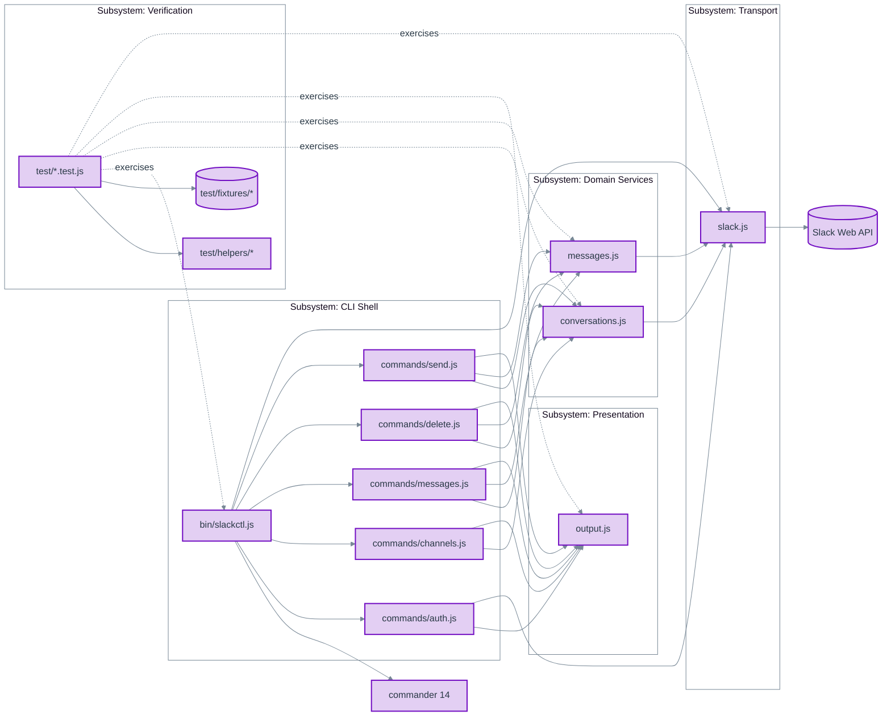
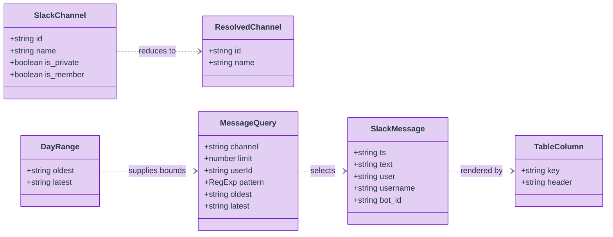
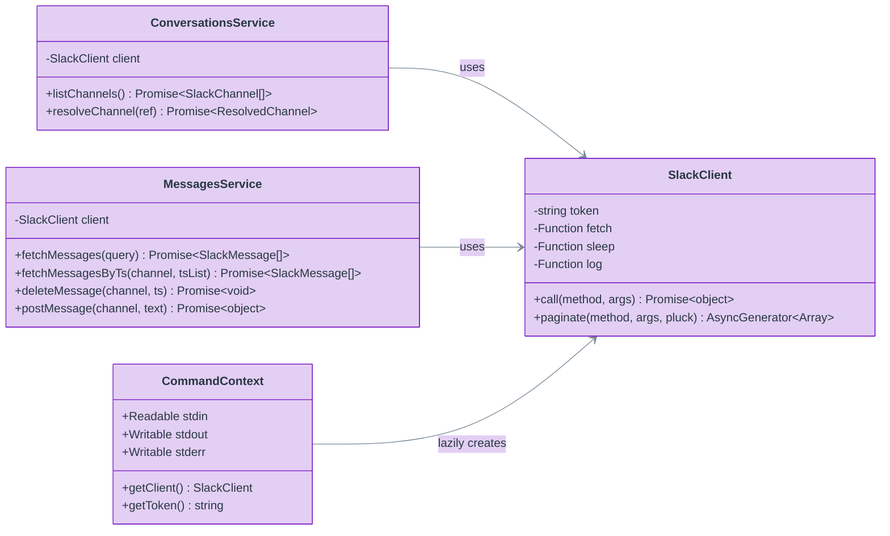
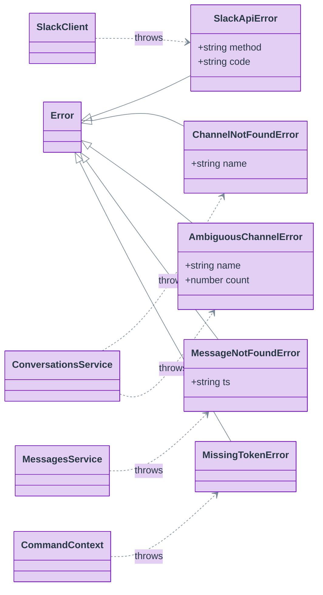
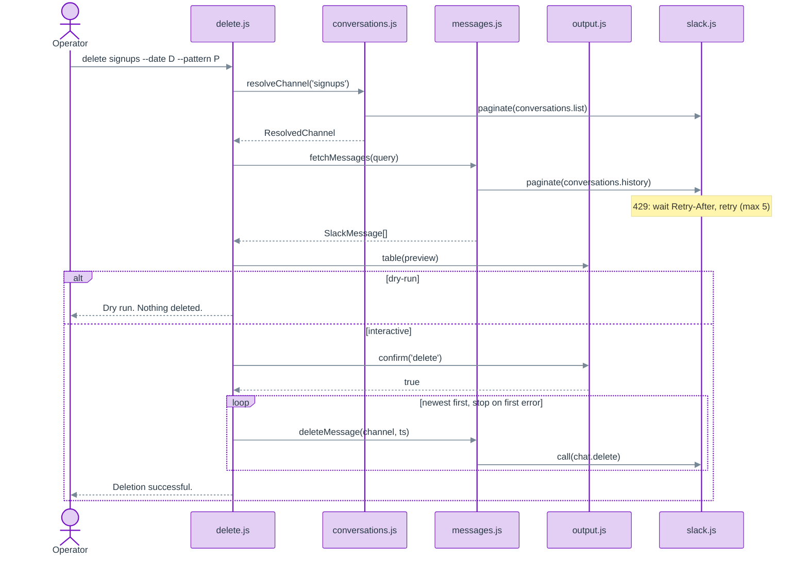

# Implementation Plan: ADR-001 slackctl CLI Architecture

**Governing ADR**: [ADR-001 0.0.6](../ADR-001-slackctl-cli-architecture-0.0.6.md) (Accepted 2026-10-02)
**Version**: 0.0.2 (supersedes [0.0.1](./ADR-001-slackctl-cli-architecture-implementation-plan-0.0.1.md))
**Date**: 2026-10-02
**Owner decisions since 0.0.1**: the transport client and the two domain services are classes with private fields and constructor injection, decided by the owner (Scott Lewis) on 2026-10-02 after weighing the closure-factory alternative; see section 7.2 item 7.
**Governing principles**: SEP² (the preamble of `~/.claude/CLAUDE.md`). Section 7 maps this plan to those principles and argues every deviation.

## 1. Scope Contract

This plan does **replace `slackctl/index.js` with the layered `slackctl` CLI specified by ADR-001 0.0.4, with its tests**, and nothing else. Anything that surfaces during implementation but is not required for that to work becomes a follow-up, not a mid-stream addition.

### Summary

Five subsystems, eleven source modules, nine implementation steps that each leave the suite green and each land as one commit, `index.js` deleted in the last step, and a two-stage review (architecture, then code) before merge. Every contract below derives from the ADR; where the ADR leaves a detail open, this plan fixes it and says so.

### Assumptions

- The owner creates a dedicated GitHub repository for `slackctl` before coding begins (Section 12, step 0). From that point the git-workflow rule applies in full: work on one `claude/slackctl-cli` branch cut from `develop`, one commit per step below, one PR back to `develop`. Nothing in this plan is implemented until that repository exists.
- Node 20.11.0 is active in the shell that runs the tool and the tests (`.node-version` via `nodenv`). Commander 14.0.3 is installed; no new packages. `npm install` runs once after the manifest edit so `package-lock.json` reflects the manifest.
- `SLACK_ADMIN_TOKEN` is a user token whose user may delete other people's messages in the target workspace. If not, `delete` without `--mine` fails with `cant_delete_message` on the first non-own message, which the ADR's failure policy handles.
- The live smoke test posts to and deletes from a Slack channel. It runs only on the owner's explicit go-ahead, against a scratch channel the owner names.

## 2. Subsystem decomposition

| Subsystem | Business capability it owns | Modules | Depends on |
| --- | --- | --- | --- |
| CLI Shell | Turning an operator's command line into a sequence of service calls with the right guards (preview, confirmation, dry run) and the right exit code | `bin/slackctl.js`, `src/commands/*.js` | Domain Services, Presentation, Transport (for `auth` only), commander |
| Domain Services | Slack's conversation and message semantics: what a channel reference means, how history is paged and filtered, how a message is deleted or posted | `src/conversations.js`, `src/messages.js` | Transport |
| Transport | Speaking the Slack Web API's HTTP envelope: auth header, `ok:false`, 429 and `Retry-After`, cursor pagination | `src/slack.js` | `fetch` |
| Presentation | Rendering tables, key/value blocks, dates, and the two interactive prompts | `src/output.js` | `node:readline` |
| Verification | Proving the four subsystems above, offline, against realistic Slack responses | `test/**` | all of the above, `node:test` |

Permitted dependencies run strictly downward in the diagram. A module may import only from modules it has an edge to. In particular Domain Services never import Presentation, Presentation never imports Transport, and Transport imports nothing from the project.



## 3. Modules and implementation artifacts

All source is CommonJS with `'use strict'`. The transport client and the two domain services are classes with `#private` fields and constructor injection (see 7.2 item 7); module-level helpers and every other export are arrow functions bound to `const`. Everything exported carries JSDoc with parameters, return values, and thrown errors. Constants are `k`-prefixed `UPPER_SNAKE_CASE`. Object literals are colon-aligned. `else` sits on its own line. Early returns over nesting.

### 3.1 `src/slack.js` (Transport)

| Artifact | Kind | Responsibility |
| --- | --- | --- |
| `kSLACK_API_BASE` | constant `'https://slack.com/api/'` | Single place the host lives |
| `kMAX_ATTEMPTS` | constant `5` | Bound on consecutive 429 retries per call |
| `kDEFAULT_RETRY_AFTER_SECONDS` | constant `1` | Used when a 429 carries no `Retry-After` |
| `SlackApiError` | class extends `Error` | Carries `method` and Slack's `code`; the only error type the transport raises for `ok:false` |
| `SlackClient` | class | The client. `constructor({ token, fetch, sleep, log })` stores the four collaborators in `#token`, `#fetch`, `#sleep`, `#log` |
| `SlackClient#call(method, args)` | async method | One POST with retry-on-429 |
| `SlackClient#paginate(method, args, pluck)` | async generator method | Cursor-following page iterator |
| `SlackClient##post(method, args)` | private method | Builds and sends one request |
| `defaultSleep(ms)` | module function | `setTimeout` promise; the default for `sleep` |
| `retryAfterSeconds(response)`, `parseResponse(method, response)` | module functions | Pure helpers; no instance state |

### 3.2 `src/conversations.js` (Domain Services)

| Artifact | Kind | Responsibility |
| --- | --- | --- |
| `kCHANNEL_ID_PATTERN` | constant `/^[CDG][A-Z0-9]{8,}$/` | Decides whether a reference is an ID |
| `kLIST_PAGE_SIZE` | constant `200` | `conversations.list` page size |
| `kLIST_TYPES` | constant `'public_channel,private_channel'` | Channel types listed |
| `ChannelNotFoundError` | class extends `Error` | `name` of the unmatched reference |
| `AmbiguousChannelError` | class extends `Error` | `name` and `count` of matches |
| `ConversationsService` | class | `constructor(client)` stores `#client` |
| `ConversationsService#listChannels()` | async method | All non-archived channels across pages |
| `ConversationsService#resolveChannel(ref)` | async method | `ResolvedChannel` from a name or ID |
| `normalizeReference(ref)` | module function | Trims and strips one leading `#` |

### 3.3 `src/messages.js` (Domain Services)

| Artifact | Kind | Responsibility |
| --- | --- | --- |
| `kHISTORY_PAGE_SIZE` | constant `100` | `conversations.history` page size (ADR Decision 5) |
| `kPATTERN_LITERAL` | constant `/^\/(.*)\/([a-z]*)$/s` | Recognizes the `/body/flags` form |
| `MessageNotFoundError` | class extends `Error` | `ts` that was not found |
| `parsePattern(expression)` | module function | `RegExp` from `/body/flags` or a bare body; pure, needs no client |
| `MessagesService` | class | `constructor(client)` stores `#client` |
| `MessagesService#fetchMessages(query)` | async method | Newest-first matches up to `limit` within optional bounds |
| `MessagesService#fetchMessagesByTs({ channel, tsList })` | async method | Exact messages by `ts`, all-or-nothing |
| `MessagesService#deleteMessage({ channel, ts })` | async method | One `chat.delete` |
| `MessagesService#postMessage({ channel, text })` | async method | One `chat.postMessage`, returns `{ ts }` |
| `matches(message, { userId, pattern })` | module predicate | AND of the author and pattern filters |
| `historyArgs(query)` | module function | Builds the `conversations.history` argument object from a `MessageQuery` |

### 3.4 `src/output.js` (Presentation)

| Artifact | Kind | Responsibility |
| --- | --- | --- |
| `kGUTTER` | constant `'  '` | Two-space column gutter |
| `kNON_TTY_MESSAGE_WIDTH` | constant `100` | `MESSAGE` width when stdout is not a terminal |
| `kMIN_MESSAGE_WIDTH` | constant `20` | Floor for narrow terminals |
| `kCONFIRM_ATTEMPTS` | constant `3` | Bad answers tolerated by `pick` |
| `table(columns, rows)` | function | Fixed-width table string |
| `reservedWidth(columns, rows)` | function | Horizontal space `table` spends on the given columns and their gutters; lets a caller size a final free-text column from the same layout rule |
| `keyValue(pairs)` | function | Aligned `Label:  value` block |
| `formatDate(ts)` | function | Local `YYYY-MM-DD HH:mm` |
| `dayRange(date)` | function | `DayRange` for a local calendar day |
| `oneLine(text, maxWidth)` | function | Collapse and truncate |
| `messageWidth(stream)` | function | Width available for `MESSAGE` |
| `authorOf(message)` | function | `user`, else `username`, else `bot_id`, else `'unknown'` |
| `isInteractive(stream)` | function | `Boolean(stream.isTTY)` |
| `createPrompter({ input, output })` | function | One line reader for the life of a command run; returns `{ ask, write, close }` |
| `confirm(expectedWord, prompter)` | async function | Typed-word challenge |
| `pick(count, prompter)` | async function | Numbered selection prompt with bounded retries |
| `parseSelection(expression, count)` | function | `1,3-5` / `all` grammar |

### 3.5 `src/commands/*.js` (CLI Shell)

Each file exports exactly `register(program, context)`. Shared option parsers live in `src/commands/options.js` so the five command files do not repeat them.

| File | Artifacts |
| --- | --- |
| `options.js` | Parsers `parsePositiveInteger(value)`, `parseTs(value)`, `collectTs(value, previous)` (variadic `--ts` accumulator), `parseDate(value)` (wraps `dayRange`), `parsePatternOption(value)` (wraps `parsePattern`), each throwing `commander.InvalidArgumentError`; factories `channelArgument()`, `limitOption()`, `mineOption()`, `patternOption()`, `dateOption()`, `tsFromOption()`, `tsToOption()`, `tsOption()`, `selectOption()`, `dryRunOption()` returning fresh `Argument`/`Option` instances with their `.conflicts()` declarations (fresh because commander mutates an `Option` when it is attached); `validateRange(options, command)` for the reversed-range check; `effectiveLimit(options)`; `effectiveBounds(options)`. `collectTs` rejects a repeated timestamp so one message can never be queued for deletion twice. The parsers are module-internal; the factories and the three helpers are the exports |
| `auth.js` | `register`; module-internal `tokenType(token)` |
| `channels.js` | `register`; module-internal `toChannelRow(channel)` |
| `messages.js` | `register`, `messageTable(messages, stdout, { numbered })` (renders the DATE/TS/USER/MESSAGE table, computing the MESSAGE width from the other columns), `queryMessages({ client, messages, channel, options })` (the candidate set a set of options selects, including the `auth.test` lookup for `--mine`); both imported by `delete.js`, see 3.7 |
| `delete.js` | `register`, `NonInteractiveError` (a prompt was required but stdin is not a terminal; one message for the confirmation, another for `--select`, so the operator is told which flag to drop; printed verbatim by the runner), and the module-internal `buildCandidates({ client, messages, channel, options })` (explicit `--ts` or `queryMessages`) and `runDeletion({ messages, channel, chosen, context })` |
| `send.js` | `register` |

### 3.6 `bin/slackctl.js` (CLI Shell)

| Artifact | Kind | Responsibility |
| --- | --- | --- |
| `kFRIENDLY_ERRORS` | constant map | Slack error code → actionable message (the ADR's listed codes) |
| `kEXIT_RUNTIME_ERROR` | constant `1` | |
| `kEXIT_USAGE_ERROR` | constant `2` | Installed through `exitOverride`; commander's own default is 1 |
| `MissingTokenError` | class extends `Error` | Thrown by `getClient` when the token is absent |
| `createContext({ env, stdin, stdout, stderr })` | function | Builds `CommandContext` with a lazy `getToken` and a memoized, lazy `getClient`; `getToken` exists because `auth` classifies the token by prefix; both throw `MissingTokenError` when the variable is empty |
| `createProgram(context)` | function | Builds the commander program and registers commands |
| `run(argv, context)` | async function | `parseAsync` over the context and error-to-exit-code mapping; returns the exit code. The executable calls it with `process.argv` and sets `process.exitCode` from the result when `require.main === module`; tests call it with a fake context |
| `describeError(error)` | module function | The message for a runtime error, per the 5.6 table |

### 3.7 Cross-cutting note on `toMessageRow`

`messages` and `delete` render identical rows and select candidates identically. `messageTable` and `queryMessages` live in `src/commands/messages.js` and `delete.js` imports them. This is a sibling import within the CLI Shell subsystem, not a layering violation, and avoids a one-function module.

## 4. Object schemas

Fields are the subset of Slack's objects this tool reads; Slack returns more, and they pass through untouched. Optionality is in the table after the diagram because Mermaid class attributes do not carry it.



| Shape | Field | Required | Notes |
| --- | --- | --- | --- |
| `SlackChannel` | `id`, `name`, `is_private`, `is_member` | yes | Raw Slack object; `is_archived` is always `false` because listing excludes archived |
| `ResolvedChannel` | `id` | yes | |
| | `name` | yes | Equals `id` when the reference was an ID (no lookup performed) |
| `SlackMessage` | `ts`, `text` | yes | `text` may be `''` |
| | `user` | no | Absent on app-posted messages |
| | `username`, `bot_id` | no | Present on app-posted messages |
| `MessageQuery` | `channel` | yes | Channel ID |
| | `limit` | no | `undefined` means unbounded |
| | `userId`, `pattern` | no | Filters, ANDed |
| | `oldest`, `latest` | no | Slack `ts` strings; when either is set, `inclusive: true` is sent |
| `DayRange` | `oldest`, `latest` | yes | `latest` is the last microsecond of the day (`.999999`) |
| `TableColumn` | `key`, `header` | yes | `header` is rendered uppercase |





`SlackClient`, `ConversationsService`, `MessagesService`, and the five error classes are the classes in the codebase. None inherits from anything but `Error`. `CommandContext` is a plain object built by `createContext`; the diagram shows its shape.

## 5. Contracts between modules

### 5.1 Transport contract (`slack.js` → everyone above it)

```js
new SlackClient({ token, fetch = globalThis.fetch, sleep = defaultSleep, log = console.error })
client.call(method, args = {})           -> Promise<object>
client.paginate(method, args, pluck)     -> AsyncGenerator<Array>
```

- `call` POSTs JSON to `kSLACK_API_BASE + method` with `Authorization: Bearer <token>` and `Content-Type: application/json`.
- HTTP 429: read `Retry-After` (seconds; `kDEFAULT_RETRY_AFTER_SECONDS` if absent or unparsable), `log('Rate limited by Slack; waiting <n>s...')`, `await sleep(n * 1000)`, retry. On the `kMAX_ATTEMPTS`th consecutive 429, throw `SlackApiError(method, 'ratelimited')`.
- Any other non-2xx status throws `Error('<method>: HTTP <status>')`.
- Body with `ok: false` throws `SlackApiError(method, body.error)`.
- `paginate` yields `pluck(result)` per page. The first request has no `cursor` key; each later request carries `cursor` from the previous `response_metadata.next_cursor`; iteration ends when that value is empty or absent. The generator does not prefetch: a consumer that stops iterating after page N causes no request for page N+1.
- `sleep` and `log` are injectable so the retry path is testable without real time. All four collaborators are `#private`; nothing outside the class can read the token.

### 5.2 Conversations contract (`conversations.js` → CLI Shell)

```js
new ConversationsService(client)
service.listChannels()        -> Promise<SlackChannel[]>
service.resolveChannel(ref)   -> Promise<ResolvedChannel>
```

- `listChannels` requests `{ types: kLIST_TYPES, exclude_archived: true, limit: kLIST_PAGE_SIZE }` on every page and concatenates `result.channels`.
- `resolveChannel`: normalize; if it matches `kCHANNEL_ID_PATTERN` return `{ id: ref, name: ref }` with no request; otherwise `listChannels` and match `channel.name === ref` exactly. Zero matches throws `ChannelNotFoundError` with message `Channel not found: <name>`; more than one throws `AmbiguousChannelError` with message `Channel name '<name>' matches <count> channels; pass the ID`.

### 5.3 Messages contract (`messages.js` → CLI Shell)

```js
parsePattern(expression)                                 -> RegExp     // module function
new MessagesService(client)
service.fetchMessages(MessageQuery)                      -> Promise<SlackMessage[]>
service.fetchMessagesByTs({ channel, tsList })           -> Promise<SlackMessage[]>
service.deleteMessage({ channel, ts })                   -> Promise<void>
service.postMessage({ channel, text })                   -> Promise<{ ts }>
```

- `parsePattern`: `kPATTERN_LITERAL` splits body and flags; otherwise the whole value is the body with no flags. A `RegExp` construction error is rethrown as `Error('Invalid pattern: <original message>')`.
- `fetchMessages` paginates `conversations.history` with `historyArgs(query)` = `{ channel, limit: kHISTORY_PAGE_SIZE }` plus `oldest`, `latest`, and `inclusive: true` when either bound is set. It keeps messages in page order (newest first) for which `matches(message, query)` holds, stops as soon as `limit` matches are collected, and returns them. `limit` `undefined` means every match in range.
- `fetchMessagesByTs`: one `call('conversations.history', { channel, oldest: ts, latest: ts, inclusive: true, limit: 1 })` per `ts`, in order. Requires `result.messages[0]?.ts === ts`, else throws `MessageNotFoundError` with message `Message not found: <ts>`. All lookups complete before any result is returned; a failure throws without a partial array.
- `deleteMessage` is `call('chat.delete', { channel, ts })`. `postMessage` is `call('chat.postMessage', { channel, text })` returning `{ ts: result.ts }`.

### 5.4 Presentation contract (`output.js` → CLI Shell)

```js
table(columns, rows)              -> string    // columns: TableColumn[]; rows: object[]; uppercase headers; width = longest cell; kGUTTER between columns; trailing newline
reservedWidth(columns, rows)      -> number    // sum over the given columns of (width as table renders it + gutter)
keyValue(pairs)                   -> string    // [['Workspace', 'Vectopus'], ...]; labels padded to the longest label plus a colon and two spaces
formatDate(ts)                    -> string    // 'YYYY-MM-DD HH:mm' in process timezone
dayRange(date)                    -> DayRange  // throws Error('Invalid date: <date>') unless a real YYYY-MM-DD
oneLine(text, maxWidth)           -> string    // ANSI escape sequences and control characters removed; whitespace runs and newlines to one space; truncated to maxWidth with a trailing '…'
messageWidth(stream)              -> number    // stream.isTTY ? max(kMIN_MESSAGE_WIDTH, stream.columns - fixed columns - gutters) : kNON_TTY_MESSAGE_WIDTH
authorOf(message)                 -> string
isInteractive(stream)             -> boolean
createPrompter({ input, output })          -> { ask(prompt): Promise<string>, write(text): void, close(): void }
confirm(expectedWord, prompter)            -> Promise<boolean>
pick(count, prompter)                      -> Promise<number[] | null>
parseSelection(expression, count)          -> number[]   // 0-based, ascending, unique; throws Error('Invalid selection: <token>')
```

- `dayRange` constructs `new Date(y, m - 1, d)` and `new Date(y, m - 1, d + 1)` in the process timezone, validates that the first round-trips to the same `y-m-d` (rejects `2026-02-30`), and returns `oldest` as seconds with six decimals and `latest` as the next midnight minus one microsecond. The bound is therefore exclusive at Slack's precision while `inclusive: true` is sent, which keeps one code path for all bounds.
- `createPrompter` opens one `node:readline` interface over `input` and queues lines, so every prompt in a command run reads from the same reader. A second reader on the same stream would miss lines the first had already consumed from a shared chunk, which is how a pipe or a paste delivers them, so a command creates one prompter, passes it to `pick` and `confirm`, and closes it when done. `ask(prompt)` writes the prompt to `output` and resolves the next line, or `''` if `input` ends first.
- `confirm` asks `Type '<expectedWord>' to confirm: ` and resolves `answer.trim() === expectedWord`.
- `pick` asks `Select messages to delete (e.g. 1,3-5 or all): `, applies `parseSelection`; on error writes the error message and re-asks; after `kCONFIRM_ATTEMPTS` failures resolves `null`.

### 5.5 Command contract (`commands/*.js` → `bin/slackctl.js`)

```js
register(program, context)   // context: CommandContext
```

- `context` is `{ getClient, getToken, stdin, stdout, stderr }`. `getToken` exists so `auth` can classify the token prefix; only `auth` calls it. A command never reads `process.env`, `process.stdin`, `process.stdout`, or `process.stderr` directly; it uses `context`. This is what makes the end-to-end tests possible without spawning a process.
- A command constructs the services it needs from `context.getClient()` at the start of its action (`new ConversationsService(client)`, `new MessagesService(client)`); services are not shared through the context because each command run is one process and construction is free.
- A command never calls `process.exit`. It returns normally for exit 0, throws one of the error classes for exit 1 (`NonInteractiveError` for the terminal refusal), or calls `command.error(message, { exitCode: 2 })` for a usage error discovered after parsing (the reversed range).
- Option parsing uses commander argument parsers from `options.js` that throw `commander.InvalidArgumentError`; mutual exclusions are declared with `Option.conflicts`. Commander turns both into usage errors; the program's `exitOverride` normalizes them to exit 2. Commander's own default usage exit code is 1. The override is installed before the subcommands are created so they inherit it, and `run` returns a CommanderError's exit code unchanged.

| Option | Parser | Conflicts with |
| --- | --- | --- |
| `--limit <n>` | `parsePositiveInteger` | `--ts` |
| `--mine` | flag | `--ts` |
| `--pattern <regex>` | `parsePatternOption` | `--ts` |
| `--date <YYYY-MM-DD>` | `parseDate` | `--ts`, `--ts-from`, `--ts-to` |
| `--ts <ts...>` | `collectTs`: `parseTs` per value, rejecting a repeated value | `--limit`, `--mine`, `--pattern`, `--date`, `--ts-from`, `--ts-to`, `--select` |
| `--ts-from <ts>`, `--ts-to <ts>` | `parseTs`; `from > to` reported via `command.error` | `--ts`, `--date` |
| `--select` | flag | `--ts` |
| `--dry-run` | flag | none |

- Effective limit: `--limit` has no commander default. `effectiveLimit(options)` returns `options.limit ?? 20` in newest-N mode and `options.limit` (possibly `undefined`) when `--date`, `--ts-from`, or `--ts-to` is present.

Per-command behavior:

- `auth`: `auth.test`; `keyValue` with Workspace (`team`), User (`user`), User ID (`user_id`), Token (`tokenType`: `xoxp-` → `user`, `xoxb-` → `bot`, prefix `xoxe` → `user (refreshable)`, else `unknown`), Status `authenticated`. On `SlackApiError`, print the block with `Status: failed (<code>)` to stdout and throw the error so the runner exits 1.
- `channels`: `listChannels`; rows `{ name, id, type: is_private ? 'private' : 'public', member: is_member ? 'yes' : 'no' }` sorted by `name`; `table` with `NAME`, `ID`, `TYPE`, `MEMBER`.
- `messages <channel>`: `resolveChannel`; `userId` from `auth.test` only when `--mine`; `fetchMessages`; `table` with `DATE`, `TS`, `USER`, `MESSAGE`; `No messages matched.` on empty.
- `delete <channel>`: `buildCandidates` (`--ts` → `fetchMessagesByTs`; otherwise `fetchMessages` with `effectiveLimit` and bounds from `--date` or `--ts-from`/`--ts-to`). Then in order: empty → `No messages matched.`; print `The following messages will be deleted:` and the table (with a leading `#` column when `--select`); `--select` → `pick`; `null` → `Aborted. Nothing deleted.`; otherwise reprint the chosen subset; `--dry-run` → `Dry run. Nothing deleted.`; not interactive → throw `NonInteractiveError('selection')` when `--select` is present (`Interactive selection requires a terminal; drop --select for a non-interactive preview.`) or `NonInteractiveError('confirmation')` when `--dry-run` is absent (`Confirmation requires an interactive terminal; use --dry-run to preview.`), both printed verbatim by the runner; `confirm('delete')` false → `Aborted. Nothing deleted.`; `runDeletion`: sequential `deleteMessage`, `Deleted <i>/<n>: <ts>` to stderr each; on a throw, write `Deleted <i> of <n>. Failed on <ts>: <code>` to stderr and rethrow; on completion write `Deletion successful. <n> messages deleted.` to stdout.
- `send <channel> <text>`: `resolveChannel`; `--dry-run` → `Dry run. Would send to #<name> (<id>):` and the text; else `postMessage` and `Sent to #<name> (<id>) at <ts>.`

### 5.6 Runner contract (`bin/slackctl.js` → operating system)

| Condition | Stream | Exit |
| --- | --- | --- |
| Command completed | data on stdout, progress on stderr | 0 |
| `MissingTokenError`, `ChannelNotFoundError`, `AmbiguousChannelError`, `MessageNotFoundError`, `NonInteractiveError` | bare message on stderr | 1 |
| `SlackApiError` with a code in `kFRIENDLY_ERRORS` | that message on stderr | 1 |
| Any other `SlackApiError` | `slackctl: <method> failed: <code>` on stderr | 1 |
| Any other error | `slackctl: <message>` on stderr | 1 |
| Usage error (commander; normalized by `exitOverride`) | commander's message on stderr | 2 |

`createContext` builds `getClient` lazily: the token is read on first call, `MissingTokenError` (`SLACK_ADMIN_TOKEN is not set.`) is thrown if empty, and the `SlackClient` instance is memoized. `help` and usage errors therefore never need the token, while every real command fails before any network call.

## 6. Runtime flow

The `delete` command in its most involved mode. `messages` is the same flow without the `alt` block; `send` is `resolveChannel` then one `call`.



## 7. SEP² compliance and justified deviations

### 7.1 How the design serves each principle

| Principle | Where it shows up |
| --- | --- |
| 1 Safety & Irreversibility | Preview before every deletion; typed `delete`; `--dry-run`; no `--yes`; non-TTY refusal; stop on first failure; `--ts` resolution is all-or-nothing; `index.js` deleted last and only with per-action approval. |
| 2 Risk & Blast Radius | Sequential deletes; one `chat.delete` per message; newest-N capped at 20 by default; live smoke confined to a scratch channel the owner names. |
| 3 Intent Before Implementation | The ADR resolved every requirement conflict (name vs ID, whose messages, `send`, module system, selection modes, confirmation word) before this plan; the plan implements intent, not the task's literal examples. |
| 4 Drive Toward Implementation | Page size (Decision 5) is a constant validated live rather than designed around; nine steps, each green. |
| 5 Visualize Architecture | ADR component diagram; this plan's module, schema, and sequence diagrams, all rendered and checked before writing. |
| 6 Engineering Standards | SRP per module (Section 2); composition over inheritance (no class extends anything but `Error`; services receive the client by constructor injection); explicit injection over magic; JS style rule applied verbatim (Section 3 preamble). |
| 7 Verification | Section 9; `npm test` green after every step; `node --check`; live smoke with recorded outcome. |
| 8 Transparency | Section 7.2 below; Risks in Section 8; the plan is amended in a new version if implementation proves it wrong. |
| 9 Operational Wrappers | `slackctl` is the wrapper: it validates the token before any call, resolves the channel, previews, and confirms, so nobody runs raw `chat.delete`. |
| 10 Autonomous Execution | Steps 1 to 8 run without check-ins, including commits and the PR; step 9's deletion, the live smoke, and the merge are the gates that principle 1 reserves for the owner. |
| Architectural thesis | Five components, each a responsibility boundary with a stated contract (Section 5); no component exists for a single function; `output.js` holds tables, dates, and prompts together because they share one reason to change (how the terminal looks and behaves). |
| Testing maxims | Section 9 names the uncertainty each test removes; fixtures are realistic Slack payloads; time is frozen via `TZ` and fixed `ts` values; failure paths (429, `ok:false`, not found, ambiguous, `cant_delete_message`, bad input) get the same rigor as success. |

### 7.2 Deviations and their justification

1. **Services return raw Slack objects rather than mapped entities.** The persona rule favors "clear separation of business logic, entities, and data store access layers". Here an entity layer would be five fields copied into a differently named object. The `idiomatic-beats-clever` rule's test applies: what would the wrapper add over the thing it wraps? Nothing but a rename. Field access is confined to `toChannelRow`, `toMessageRow`, and `authorOf`, so if Slack's shape changes, three functions change. An entity layer would move those same three edits into mappers and add the mappers. Rejected as gratuitous abstraction.

2. **`delete.js` imports `toMessageRow` from the sibling `commands/messages.js`.** Clean layering would put shared presentation in `output.js`. But `toMessageRow` is command-level knowledge (which Slack fields become which columns), not rendering knowledge (how a table is drawn), and only two commands use it. Putting it in `output.js` would make Presentation depend on the shape of `SlackMessage`, which is a Domain Services concern. A sibling import inside one subsystem is the smaller coupling.

3. **No `src/program.js`; `createProgram` lives in `bin/slackctl.js` behind a `require.main` guard.** Separating the program factory from the executable is cleaner in the abstract. The ADR fixes the layout and the layout has no such module; adding one would be a design change outside the approved ADR (approved-design-authority rule). The guard gives tests the same import seam at no architectural cost.

4. **A shared `src/commands/options.js` is added beyond the ADR layout.** The ADR layout lists only the five command files under `commands/`. Without a shared module, `delete.js` and `messages.js` would duplicate seven option definitions and four parsers, which the coding-style rule forbids and which would let the two commands' option semantics drift, breaking the ADR's "same options list the same messages" rationale. This is an implementation artifact within the CLI Shell component, not a new component, so it is within the plan's authority. Flagged here so the owner can object.

5. **Tests spy on request arguments (`calls`), which the test-design rule calls implementation bonding.** For a transport whose entire contract is "send this request shape to Slack", the request shape *is* the observable behavior; there is no other output to assert. The spy is used only to assert the contract (`exclude_archived: true` is sent, no `chat.delete` happens on dry run, the cursor is forwarded), never call order or internal structure.

6. **`fetchMessages` stops the generator early rather than draining it.** This is a performance choice that leaks into the contract ("does not prefetch"). It is stated as a contract because on a rate-limited tier an extra page costs a minute, which makes it behavior the operator can observe. It is tested as such.

7. **`SlackClient`, `ConversationsService`, and `MessagesService` are classes.** The architectural-decomposition skill says not to default to classes, and a closure-based factory would give the same injection with free privacy and bound methods. The owner chose classes after weighing both (2026-10-02): a named type that appears in stack traces, JSDoc, and the diagrams as drawn, and one construction style across the client, the services, and the error types, consistent with the service-oriented structure the persona rule prefers. The mechanical arguments for the closure do not bite here: nothing detaches a method, so `this` binding is not at risk, and `#private` fields keep the token as unreachable as a closure would. What the class must not become is a base class; no inheritance is permitted beyond `extends Error`, and a reviewer should treat an `extends SlackClient` or `extends MessagesService` as a defect.

## 8. Risks and edge cases

- **Slack rejects `limit: 100` on the restricted history tier.** Detected in the live smoke test. `kHISTORY_PAGE_SIZE` is one constant; lower it and amend ADR Decision 5 in the same change, as the ADR anticipates.
- **`Retry-After` missing or non-numeric on a 429.** `kDEFAULT_RETRY_AFTER_SECONDS` keeps the loop bounded by attempts.
- **A `--ts` that is a thread-only reply.** `conversations.history` omits it; `MessageNotFoundError`, as the ADR specifies.
- **Messages with `subtype`** (joins, bot posts, edits). Ordinary history entries, listed and deletable; `authorOf` handles the missing `user`.
- **`--pattern` against raw markup** (`<mailto:...|...>`). Documented in the ADR; the preview shows the raw text that was matched.
- **Narrow terminals.** `messageWidth` floors at `kMIN_MESSAGE_WIDTH`.
- **`TZ` set at runtime in tests.** Node honors a runtime `process.env.TZ` change; the assignment precedes any `Date` construction in each test file.
- **Operator confirms, then a later `chat.delete` fails.** Earlier deletions are already irreversible; the report names the exact count and the failing `ts` so the operator knows the state. Re-running is safe because deleted messages are gone from history.

## 9. Test plan

Runner: `node --test test/` via `npm test`. Assertions: `node:assert/strict`. No test touches the network.

### 9.1 Harness

| Helper | Contract |
| --- | --- |
| `test/helpers/fake-slack.js` → `createFakeSlack(routes)`, `historyRoute(messages, { maxPageSize })` | `createFakeSlack` returns `{ fetch, calls }`. `routes` maps a method name to one response, an ordered array consumed per request (pagination, 429 sequences), or a function of the request args. A response is `{ status = 200, headers = {}, body }`. `calls` is `[{ method, args, headers }]`. Requests to an unrouted method throw, so an unexpected call fails the test. `historyRoute` is a `conversations.history` route that behaves like Slack: newest first, honoring `oldest`, `latest`, `inclusive`, `limit`, and cursor paging, with an optional page-size cap modeling the restricted tier, so bounds and limits are asserted against Slack-like behavior rather than canned pages. |
| `test/helpers/streams.js` → `scriptedInput(lines, { isTTY })`, `capture()` | A readable that yields the lines, with `isTTY` settable; a writable that collects text into `.text`. |
| `test/helpers/context.js` → `fakeContext({ routes, token, stdinLines, isTTY })`, `runCommand(argv, options)` | `fakeContext` assembles a `CommandContext` over the two helpers with a real `SlackClient` (`new SlackClient({ token, fetch, sleep: async () => {}, log })`). `runCommand` builds the program over it and runs `parseAsync`, resolving with the harness or rejecting with the thrown error. |
| `test/fixtures/*.json` | Realistic payloads: workspace `Vectopus`, user `Scott Lewis` / `U01234567`; channels `general`, `development`, `client-project` (private), `random`, `signups`; `development` history by Scott and one other user; `signups` history of eleven app-posted `New signup: ...` notices with `bot_id`, `username: 'VectorIcons Messenger'`, and `<mailto:...|...>` markup (mailboxes under `example.invalid`, never routable addresses), spread across 2026-09-30 and 2026-10-01 in `America/New_York`. |

Every test file sets `process.env.TZ = 'America/New_York'` before its first `require`. Every test states its scenario in a leading comment.

### 9.2 Transport (`test/slack.test.js`)

| Scenario | Assertion | Uncertainty removed |
| --- | --- | --- |
| `ok:false` body with `error: 'channel_not_found'` | throws `SlackApiError` with `method` and `code` | API errors surface as typed errors, not silent results |
| 429 with `Retry-After: 2`, then 200 | `sleep` called once with 2000; `log` called once with the wait line; result returned | Reactive wait honors Slack's number |
| 429 with no `Retry-After`, then 200 | `sleep` called with 1000 | Missing header does not hang or crash |
| 429 with `Retry-After: 0`, then 200; 429 with `Retry-After: 2junk`, then 200 | `sleep` called with 0; `sleep` called with 1000 | Zero is honored; a malformed header falls back rather than being partially parsed |
| five consecutive 429s | throws `SlackApiError` with `code === 'ratelimited'`; `sleep` called four times | Retry is bounded |
| two consecutive 200s | `sleep` never called | No fixed sleeps anywhere |
| HTTP 500 | throws `Error` naming the method and status | Non-Slack failures are not mistaken for API errors |
| two-page `paginate` | first request lacks `cursor`; second carries the first page's `next_cursor`; generator ends after page two | Cursor following is correct |
| consumer breaks after page one | only one request recorded | No prefetch |

### 9.3 Presentation (`test/output.test.js`)

| Scenario | Assertion |
| --- | --- |
| `table` over three rows with a long middle cell | exact string: uppercase headers, widths from the longest cell, two-space gutters |
| `keyValue` with labels of different lengths | values align in one column |
| `formatDate('1759343520.000100')` | `'2026-10-01 14:32'` under `America/New_York` |
| `dayRange('2026-09-30')` | `oldest` is local midnight 2026-09-30 as `ts`; `latest` is local midnight 2026-10-01 minus one microsecond |
| `dayRange('2026-02-30')`, `dayRange('yesterday')` | throws `Invalid date: ...` |
| `oneLine` on text with newlines and a run of spaces, width 20 | single line, truncated with `…` at 20 |
| `oneLine` on text carrying ANSI clear-screen, cursor, OSC, bell, NUL, and a C1 byte | every escape sequence and control character removed; visible text kept |
| `oneLine` with a surrogate-pair emoji at the cut | truncated by code point: the emoji is kept whole or dropped, never split |
| `authorOf` for a user message, an app message with `username`, an app message with only `bot_id` | the expected field in each case |
| `parseSelection('1,3-5', 6)` | `[0, 2, 3, 4]` |
| `parseSelection('all', 6)` | `[0..5]` |
| `parseSelection` of `'0'`, `'7'`, `'5-3'`, `'a'`, `''` against 6 | each throws `Invalid selection: <token>` |
| `confirm('delete')` with input `delete` / `DELETE` / `yes` | `true` / `false` / `false` |
| `pick(4)` with input `2,4` | `[1, 3]` |
| `pick(4)` with inputs `9`, `x`, `0` | `null` after three prompts |

### 9.4 Conversations (`test/conversations.test.js`)

| Scenario | Assertion |
| --- | --- |
| `listChannels` over two pages | all channels in page order; every request carries `exclude_archived: true` and `limit: 200` |
| `resolveChannel(client, 'C01234ABC')` | returns `{ id, name }` equal to the ID; `calls` is empty |
| `resolveChannel(client, '#development')` | resolves to `C02345DEF` across two pages |
| `resolveChannel(client, 'nonexistent')` | throws `ChannelNotFoundError` with the specified message |
| two channels named `random` in the fixture | throws `AmbiguousChannelError` naming the count |

### 9.5 Messages (`test/messages.test.js`)

| Scenario | Assertion |
| --- | --- |
| `fetchMessages` with `userId` and `limit: 3` over a three-page history where own messages are sparse | exactly three messages, all by `userId`, newest first; only the pages needed were requested |
| `fetchMessages` with `limit: 3` and no filters | the three newest regardless of author |
| `fetchMessages` with `oldest` and `latest`, no limit | both bounds and `inclusive: true` on every request; every message in range returned |
| `fetchMessages` with `pattern` `/testmember[0-9]+/` over the signups fixture | only `testmember` notices; `limit` counts only those |
| `fetchMessages` with both `userId` and `pattern` | only messages satisfying both |
| `parsePattern('/testmember[0-9]+/i')` | `RegExp` with `flags === 'i'` |
| `parsePattern('testmember[0-9]+')` | `RegExp` with `flags === ''` |
| `parsePattern('/[/')` | throws `Invalid pattern: ...` |
| `fetchMessagesByTs` with two valid `ts` | returned in the given order; each request has `oldest === latest === ts`, `inclusive: true`, `limit: 1` |
| `fetchMessagesByTs` where the second `ts` is absent | throws `MessageNotFoundError` naming it; no partial result |
| `deleteMessage` when Slack answers `cant_delete_message` | `SlackApiError` propagates |
| `postMessage` | request carries `channel` and `text`; returns `{ ts }` from the response |

### 9.6 Commands end-to-end (`test/commands.test.js`, `test/commands-messages.test.js`, `test/commands-delete.test.js`, `test/commands-send.test.js`)

One test file per command, so each step's commit carries its own tests and leaves the suite green on its own.

Built with `createProgram(fakeContext(...))`, `program.exitOverride()`, `parseAsync(['node', 'slackctl', ...argv])`. Usage errors are asserted via the thrown `CommanderError.exitCode === 2`; runtime errors via the thrown error class.

| Scenario | Assertion |
| --- | --- |
| `auth` with an `xoxp-` token | stdout has the five fields with `Token: user`, `Status: authenticated` |
| `auth` when Slack answers `invalid_auth` | stdout shows `Status: failed (invalid_auth)`; `SlackApiError` thrown |
| `channels` | sorted table from two pages |
| `channels` with no token | `MissingTokenError`; `calls` empty |
| `--help` with no token | help text; no error |
| `messages development --mine --limit 3` | name resolved; three rows all by `U01234567` |
| `messages development --limit 3` | three rows with mixed `USER` values |
| `messages signups --date 2026-09-30 --pattern '/testmember[0-9]+/'` | only that day's `testmember` notices; `USER` is `VectorIcons Messenger` |
| `messages development --limit 0`, `--pattern '/[/'`, `--date 2026-02-30` | usage error |
| `messages` with nothing matching | `No messages matched.` |
| `delete development --limit 3 --dry-run` | preview printed; no `chat.delete` in `calls` |
| `delete development --limit 3` with stdin `delete`, TTY | three `chat.delete` calls in preview order; `Deletion successful. 3 messages deleted.` |
| same, second delete answers `cant_delete_message` | one `chat.delete` succeeded; stderr has `Deleted 1 of 3. Failed on <ts>: cant_delete_message`; `SlackApiError` thrown |
| `delete development --limit 3` with stdin `yes`, TTY | `Aborted. Nothing deleted.`; no `chat.delete` |
| `delete development --limit 3`, stdin not a TTY | refusal error; no `chat.delete` |
| `delete development --ts A B` | preview of exactly A and B; deletes A then B |
| `delete development --ts A Z` (Z unknown) | `MessageNotFoundError`; no `chat.delete` |
| `delete development --ts-from X --ts-to Y` | preview of every fixture message in range and none outside |
| `delete development --ts-from Y --ts-to X` | usage error |
| `delete development --ts A --limit 5` | usage error |
| `delete development --ts A A` | usage error; nothing deleted |
| `delete development --date 2026-09-30 --ts-from X` | usage error |
| `delete signups --date 2026-09-30 --pattern '/testmember[0-9]+/' --select`, stdin `2,4` then `delete` | second and fourth candidates deleted, nothing else |
| `delete ... --select`, stdin `9`, `9`, `9` | `Aborted. Nothing deleted.`; no `chat.delete` |
| `delete ... --select --dry-run`, stdin `1` | pick happens; no confirmation prompt; no `chat.delete` |
| `delete ... --select --dry-run`, stdin not a TTY | `NonInteractiveError` naming `--select`; no prompt; no `chat.delete` |
| `send development "PR is ready" --dry-run` | preview with `#development (C02345DEF)`; no `chat.postMessage` |
| `send development "PR is ready"` | `chat.postMessage` with the resolved ID; `Sent to #development (C02345DEF) at <ts>.` |
| `send nonexistent "x"` | `ChannelNotFoundError` |

### 9.7 Runner (`test/runner.test.js`)

Calls `run(argv, context)` with a fake context and asserts the exit code and the streams, one test per row of the 5.6 table, so that removing the `exitOverride` or an error mapping fails a test.

| Scenario | Assertion |
| --- | --- |
| `channels` succeeds | 0; table on stdout; stderr empty |
| `--help`, `--version`, `help delete`, no token configured | 0; stdout non-empty |
| missing argument, invalid option value, conflicting options | 2; commander's `error: ...` on stderr; stdout empty |
| no token | 1; stderr is exactly `SLACK_ADMIN_TOKEN is not set.` |
| unknown channel name | 1; stderr is exactly `Channel not found: nonexistent` |
| `delete` with non-TTY stdin | 1; stderr is exactly the confirmation refusal message, no prefix |
| `auth` on `invalid_auth` | 1; stderr is the explanation for `invalid_auth` |
| `channels` on an unlisted Slack code | 1; stderr is `slackctl: conversations.list failed: <code>` |
| `channels` on HTTP 500 | 1; stderr is `slackctl: conversations.list: HTTP 500` |

### 9.8 Live smoke (manual, gated)

Only on the owner's explicit go-ahead, in a scratch channel the owner names: `auth`; `channels`; `messages <scratch> --limit 3`; `delete <scratch> --dry-run --limit 1`; `send <scratch> "slackctl smoke test" --dry-run`; four real `send`s (three matching `smoke-[0-9]+`); `delete --ts` of the first; `delete --date <today> --pattern '/smoke-[0-9]+/' --select` picking `1`; `delete --limit 2`. Record whether Slack accepted `limit: 100` and whether any 429 occurred.

## 10. Verification plan

### 10.0 Live smoke outcome (2026-10-02, #general, authorized by the owner)

Run after step 9 against the vectoricons workspace with the owner's user token. `auth`, `channels`, `messages general --limit 3`, `delete general --dry-run --limit 1`, and `send general ... --dry-run` behaved as specified. Four messages were sent; `delete --ts` removed the first, `delete --date 2026-10-02 --pattern '/smoke-[0-9]+/' --select` with pick `1` removed one, and the remaining two were removed with `delete --pattern 'slackctl smoke' --limit 2` rather than the plan's bare `--limit 2`, because #general is a live channel and an unrelated post arriving between steps would otherwise have been selected; the deletion path exercised is identical. A final `messages --date --pattern` confirmed none remained. Slack accepted `limit: 100` on `conversations.history` (ADR Decision 5 holds; no change to the constant) and no 429 occurred. The run also established that a pseudo-terminal can report `isTTY` without `columns`; `messageWidth` floors the width in that case. App-posted messages in the live channel carried `bot_id` but no `username`, so `USER` showed the bot ID, as Decision 11's fallback specifies.

- `npm test` green after every step and before every commit.
- `node --check` on every new file.
- `node bin/slackctl.js --help` and `node bin/slackctl.js delete --help` render the documented options and conflicts.
- Section 9.8 after step 9; the outcome is recorded in 10.0.

### 10.1 Review sequence

Reviews are sequential, not parallel, by the owner's instruction. Architecture accountability comes first so that code-quality findings are never raised against code that is about to change shape.

1. **Archie** (`archie` agent) reviews the PR against ADR-001 0.0.4, this plan, SEP², and the repository rules. Findings are addressed per the adversarial-review rule's table (`BLOCKER` and `MAJOR` fixed now; `MINOR` fixed or tracked in an issue). Archie is re-requested until the disposition is **PASS** or **PASS WITH NON-BLOCKING FINDINGS**.
2. **Qoala** (`qoala` agent) is requested only after Archie's sign-off and reviews for correctness, security, and testing adequacy. Findings are addressed per the same table (`[SEV: security]`, `[SEV: core]`, and `[fix-now]` fixed now; `[defer-ok]` fixed or tracked). Qoala is re-requested until the recommendation is **Approve** or **Approve with suggestions**.
3. If a Qoala fix changes structure, Archie is re-requested on the result before Qoala's final pass, so the architectural sign-off always covers the merged shape.

Copilot review, if enabled on the repository, runs alongside per the `copilot-review-loop` workflow and does not replace either agent.

## 11. Documentation / ADR needs

- ADR required: yes, ADR-001 0.0.4 (Accepted).
- Documentation required: this plan. ADR Decision 5 is amended only if the live run contradicts it. No README is in scope.

## 12. Implementation order

Each step is one commit that leaves the suite green. Commit prefixes follow the git-workflow rule (`feat:`, `chore:`, `docs:`).

0. **Repository (owner).** The owner creates the GitHub repository for `slackctl`, with `develop` as the integration branch, and seeds it with the current `slackctl/` contents (`package.json`, `package-lock.json`, `.node-version`, `index.js`, `docs/`). The agent then cuts `claude/slackctl-cli` from `develop` per the `new-claude-branch` workflow and commits this plan first (`docs: add ADR-001 and implementation plan`) before any code.
1. **Manifest and transport.** Edit `package.json` (remove `"type": "module"`; add `engines`, `scripts.test`, `description`, `author`, `license: "UNLICENSED"`, `private: true`); `npm install` to sync the lock. Add `src/slack.js`, `test/helpers/fake-slack.js`, `test/slack.test.js` (Section 9.2).
2. **Presentation.** Add `src/output.js`, `test/helpers/streams.js`, `test/output.test.js` (Section 9.3).
3. **Conversations service.** Add `src/conversations.js`, channel fixtures, `test/conversations.test.js` (Section 9.4).
4. **Messages service.** Add `src/messages.js`, history fixtures, `test/messages.test.js` (Section 9.5).
5. **Entry, options, `auth`, `channels`.** Add `bin/slackctl.js`, `src/commands/options.js`, `src/commands/auth.js`, `src/commands/channels.js`, `test/helpers/context.js`, `test/commands.test.js` with the `auth`, `channels`, token, and help cases.
6. **`messages` command.** Add `src/commands/messages.js`; extend `commands.test.js` with the `messages` cases.
7. **`delete` command.** Add `src/commands/delete.js`; extend `commands.test.js` with every `delete` case.
8. **`send` command.** Add `src/commands/send.js`; extend `commands.test.js` with the `send` cases.
9. **Remove the obsolete and verify.** Re-verify `index.js` is unreferenced (`grep -rn "index.js" --exclude-dir=node_modules .`), request explicit approval, delete it (`chore: remove superseded index.js`). Run the full verification plan. Live smoke on the owner's go-ahead.
10. **Pull request and review.** Open the PR against `develop` with the scope contract from Section 1 and the checklist from this section, then run the review sequence in Section 10.1. Merge is the owner's call.

## 13. Code being removed

- `slackctl/index.js`: superseded in full. Unreferenced per the ADR's verification; re-verified immediately before deletion in step 9.
- `"type": "module"` in `slackctl/package.json`: removed in step 1.

## 14. Approval required

Implementation must not begin until the owner explicitly approves this plan.
